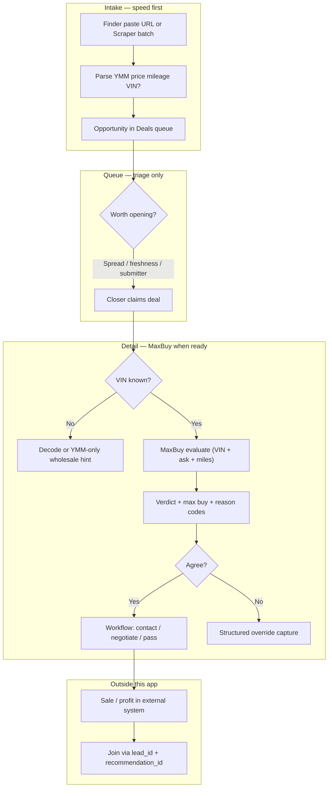

# Workflow & UI Redesign — Product Spec (Draft)

**Status:** Draft — planning only, no implementation yet  
**Last updated:** 2026-05-31  
**Owner:** Product / UX  
**Related:** [IMPLEMENTATION-PLAN.md](../IMPLEMENTATION-PLAN.md) · [v2-opportunities.md](v2-opportunities.md) · [ui-improvements-backlog.md](ui-improvements-backlog.md) · [NEXT_STEPS.md](../NEXT_STEPS.md) · [app-api.md](../03-api/app-api.md) · [MaxBuy docs](../07-buybox/README.md) · **[Flowcharts (Lucidchart)](workflow-flowcharts.md)**

---

## 1. Why this doc exists

The app works, but it still feels like **the same data recycled across pages** — dense tables, ops-heavy navigation, and forms that slow people down at the lane.

This document captures the **next evolution** beyond the Classic/New toggle:

1. **Lead intake** — fast submit, parse-from-link, required fields, provenance
2. **Information architecture** — tabs, nav, and pages that match how buyers and finders actually work
3. **Visual design** — clearer hierarchy, fewer “developer console” moments
4. **Attribution prep** — track who brought what, even though sale/profit data lives outside this app
5. **MaxBuy placement** — where the adaptive max-buy engine lives in the same flow (without breaking the pipeline model)

Nothing here is approved for build until sections marked **OPEN** are decided.

---

## 2. Design principles (non-negotiable)

| Principle | What it means in practice |
|-----------|---------------------------|
| **Speed** | Fewest clicks from “I found a deal” to “it’s in the queue.” Paste URL → fields fill → submit. |
| **Ease** | No jargon by default. One obvious next action per screen state. |
| **UX first** | Layout serves the job (find, submit, work, pass) — not the database schema. |
| **Same data, better surfaces** | Reuse existing API concepts (`normalized_listings`, `leads`, workflow). Redesign presentation and intake — don’t fork truth. |
| **Provenance from day one** | Every record knows *how* it entered (human vs scraper) and *who* touched it (when applicable). |
| **Profit is external** | This app does not store sold-unit economics. It exposes stable IDs so downstream systems can join profit later. |
| **One job per screen** | Queue = triage. Detail = decide. MaxBuy = answer “what should we pay?” — don’t repeat all three on every page. |

---

## 3. Current state (baseline)

### 3.1 Navigation today

**Classic shell** (`web/components/app-shell/nav.ts`):

| Nav item | Route | Audience |
|----------|-------|----------|
| Dashboard | `/dashboard` | Everyone |
| Opportunities | `/opportunities` | Everyone |
| Ingest Monitor | `/ingest` | Ops |
| VIN / MMR Lab | `/mmr-lab` | Ops |
| TAV Historical Data | `/historical` | Ops |
| Admin / Integrations | `/admin` | Admin |

**New shell** (`web/lib/app-shell/nav-new.ts`) — partial role split:

| Buyer nav | Route |
|-----------|-------|
| Home | `/dashboard` |
| Opportunities | `/opportunities` |
| Submit listing | `/opportunities/submit` |
| My work | `/my-work` |

Ops tools (Ingest, Value a vehicle, Historical, Admin) live in a separate section for admins.

**Problem:** Even in New mode, most pages reuse the same table/panel patterns. Home, Opportunities, My work, and detail pages show overlapping columns with different filters — it reads as recycled data, not distinct jobs.

### 3.2 Manual submit today

- Route: `POST /app/opportunities/manual` · UI: `/opportunities/submit`
- **Only URL is required**; YMM, price, mileage are optional and typed by hand
- **No link parsing** — marketplace `source` is inferred from URL host only
- **Submitter tracked** in `manual_opportunity_submissions.submitted_by_user_id`
- **Dedup:** URL upsert warns `listing_already_exists` but still records submission
- Creates `normalized_listings` + manual submission row — **not** a `leads` row
- Queue type: `manual_submission`

### 3.3 Scraper ingest today

- Route: `POST /ingest` (HMAC) · pipeline: raw → normalized → scored → `leads` (if grade ≠ pass)
- **Dedup** on `normalized_listing_id` / URL
- **No person attached** — scraper leads have no submitter
- `leads.source` = **marketplace** (facebook, craigslist, …), not entry channel
- Scrape run provenance: `normalized_listings.source_run_id`

### 3.4 Attribution hooks (future)

- `purchase_outcomes.lead_id` exists for linking sold units — **currently unpopulated**
- Manual path tracks submitter; scraper path does not
- No unified `entry_method` field (manual | scraper | import)

---

## 4. Target: lead intake flow

### 4.1 Manual submit (finder / buyer)

**User story:** Paste a listing link, tap once to parse, confirm or edit, submit.

| Step | Behavior |
|------|----------|
| 1 | User pastes **listing URL** |
| 2 | **One action:** “Pull details” (or auto-trigger on paste debounce) |
| 3 | Server/worker fetches or parses listing → prefills YMM, price, mileage, title, region hint |
| 4 | User confirms required fields, optional notes / assignee |
| 5 | Submit → DB row with **entry_method = manual**, **submitted_by_user_id** set |

**Required fields (confirmed — WF-1):**

| Field | Required? | Notes |
|-------|-----------|-------|
| Listing URL | Yes | Primary key for dedup |
| Region | Yes | **Force pick every time** (WF-9) — no default |
| Year / Make / Model | Yes | From parse or manual entry |
| Price | Yes | From parse or manual entry |
| Mileage | No | Allow submit without; badge **“Mileage unknown”** — MaxBuy/valuation must treat as low confidence (WF-8) |
| Assignee | No | Optional route-to-closer |
| Notes | No | Finder context |

**Validation UX:** Block submit until required fields present. Show parse errors inline (“Couldn’t read this listing — fill in manually”).

**Dedup UX (confirmed — WF-7):** If URL exists → **block submit**, show link to existing deal, and **log attribution** (“Jordan re-submitted this”) without creating a duplicate row.

### 4.2 Scraper ingest (automated)

**User story:** Worker runs on schedule; new deals appear in queue without human paste.

| Step | Behavior |
|------|----------|
| 1 | Scraper POSTs batch to `/ingest` |
| 2 | Adapter parses YMM, price, mileage, URL |
| 3 | **Dedup check** before create (existing normalized listing / lead) |
| 4 | Create or update with **entry_method = scraper**, **submitted_by_user_id = null** |
| 5 | Optional: `source_run_id` + scraper job name for ops debugging |

**Dedup rule (proposed):** Same as today at URL level; surface “Seen again” badge when rescraped (price/mileage change).

### 4.3 Two dimensions of “source” (important)

Do **not** overload one field. Track both:

| Dimension | Column (proposed) | Examples |
|-----------|-------------------|----------|
| **Marketplace** | `marketplace` or keep `source` | facebook, craigslist, autotrader |
| **Entry method** | `entry_method` | `manual`, `scraper`, `import` |
| **Human attribution** | `submitted_by_user_id` | UUID when manual; null when scraper |
| **Closer attribution** | workflow fields | assigned_to, claimed_by (existing) |

Later analytics: *“Alex submitted 20 leads; 5 converted; $X profit joined from external sales system via lead_id.”*

### 4.4 External profit join (out of scope for UI, in scope for schema)

This app **will not** display profit dashboards in v1 of this redesign.

**Prepare now:**

- Stable `lead_id` and/or `normalized_listing_id` on every opportunity
- `submitted_by_user_id` on manual entries
- Document join contract for external systems (`purchase_outcomes.lead_id` or future attribution table)

**Later (separate system or report):** aggregate profit per submitter, per closer, quality vs quantity.

---

## 5. MaxBuy in the unified workflow

MaxBuy is the **adaptive max-buy decision engine** documented in [`docs/07-buybox/`](../07-buybox/README.md). It answers:

> What will TAV sell this for, what will it cost us, and what is the most we should pay?

This section is how MaxBuy **fits the intake + deals redesign** — not a repeat of the engineering spec.

### 5.1 Two different “buybox” things (do not merge)

| | **Ingest buy-box rules** (live today) | **MaxBuy** (pre-code) |
|---|--------------------------------------|------------------------|
| **What** | Static `tav.buy_box_rules` matched at scrape time | TAV historical benchmarks + max-buy math + verdict |
| **When** | Automatically on `/ingest` | On demand — user runs a VIN lookup |
| **Input** | YMM, price, region from listing | **VIN-first** (+ optional mileage, asking price) |
| **Output** | `buy_box_score`, `deal_score`, `grade` on `tav.leads` | `recommended_max_buy`, Strong Buy / Buy / Review / Pass, reason codes |
| **UI today** | Spread + deal score in Opportunities queue | Not shipped — `/mmr-lab` is wholesale lookup only |

**Product rule:** ingest scoring **stays** for high-volume triage. MaxBuy **adds** a deeper decision layer when a human (or VIN) is ready — it does not replace the queue sort keys on day one.

### 5.2 MaxBuy is a fifth concept (architecture constraint)

Per [`ARCHITECTURE.md`](../07-buybox/ARCHITECTURE.md) §4:

```text
Raw Listing → Normalized Listing → Vehicle Candidate → Lead   (existing pipeline)
                                                      ↘
                        MaxBuy Recommendation  (parallel — tav.maxbuy_* tables)
```

- MaxBuy **reads** outcomes, valuations, benchmarks — it **does not write** to `leads` or `normalized_listings`.
- A recommendation is an **immutable decision snapshot** (`maxbuy_recommendations`), not a lead status change.
- Phase 3 MaxBuy ships **Create-from-recommendation** — links snapshot → opportunity workflow without collapsing the concepts.

The UI must treat MaxBuy as **“evaluate this vehicle”**, not “another row type in the queue.”

### 5.3 End-to-end flow (target)



**Speed implication:** MaxBuy does **not** run on every scraper row at ingest (missing VIN, cost, latency). It runs when someone is **working the deal** or at the **lane** (standalone VIN entry).

### 5.4 Where MaxBuy appears in the UI

| Surface | MaxBuy role | Priority |
|---------|-------------|----------|
| **Submit page** | Optional: capture VIN if parse finds it — **no** full evaluate on submit | P2 |
| **Deals queue** | Compact badge if already evaluated: `Buy · $15.5k max` — **not** a second score column | P2 |
| **Deal detail / preview** | **Primary surface** — “Run max buy” with asking price pre-filled from listing | **P0** |
| **Standalone tool** | Lane / desktop VIN entry — evolves `/mmr-lab` → **MaxBuy** (mobile-first) | **P0** |
| **Home** | No evaluate — tile link only (“Value a VIN”) | P3 |
| **Ingest monitor** | None — ops only | — |

**Deal detail — proposed layout (hero + decision card):**

```text
┌─ Listing hero ─────────────────────────────────────────────┐
│ 2019 Toyota Camry SE · $15,200 · 48k mi · Facebook         │
│ Submitted by Jordan · Manual · May 31                      │
│ [Open listing]  [I'm working this]                         │
└────────────────────────────────────────────────────────────┘

┌─ MaxBuy (when VIN + evaluate) ─────────────────────────────┐
│ Wholesale (MMR): $18,000                                   │
│ TAV usually clears this segment at 97% after ~$1,100 costs │
│ Recommended max buy: $15,530          Verdict: BUY           │
│ Data strength: high · [Why?] reason codes + comp summary   │
│ $330 under ask — room to make target net                     │
│ [Pass anyway] [Bid lower] [Create work item from snapshot]   │
└────────────────────────────────────────────────────────────┘

┌─ Workflow stepper ─────────────────────────────────────────┐
│ Found → Working → Contacted → Outcome                      │
└────────────────────────────────────────────────────────────┘
```

**Two-state display** (MaxBuy charter): if **asking price present** → show verdict + delta to ask (`deal_fit`). If **VIN only** → show ceiling max buy, no fake buy/pass against a price that doesn’t exist (`vehicle_fit`).

**Never in v1 UI:** percentage “confidence” — use **data strength** label only ([`07-buybox/TECHNICAL-SPEC.md`](../07-buybox/TECHNICAL-SPEC.md) §2).

### 5.5 Navigation change for MaxBuy

| Today | Target |
|-------|--------|
| `/mmr-lab` — “Value a vehicle” (MMR only) | **`/maxbuy`** — “Max buy lookup” (VIN → full economics + verdict) |
| Wholesale value in queue tooltip | Keep as quick signal; MaxBuy is the **decision** layer |
| MaxBuy buried in ops Tools | **Buyer-accessible** — closers use it daily at lane |

Buyer primary nav becomes:

```text
Home · Deals · Submit · My deals · Max buy
```

Ops Tools retains ingest, historical, admin. Analytics (profit per person) stays **external** — this app only stores join keys.

### 5.6 How MaxBuy connects to attribution

Three different “who” questions — design for all, conflate none:

| Question | Stored on | Used for |
|----------|-----------|----------|
| Who **brought** the listing? | `submitted_by_user_id`, `entry_method` | Finder leaderboard (quality > quantity) |
| Who **worked** the deal? | `claimed_by`, workflow actions | Closer activity |
| Who **ran MaxBuy** / overrode it? | `maxbuy_lookups.user_id`, `maxbuy_overrides` | Model adoption + learning loop |

**Full join chain (future analytics, outside this app’s UI):**

```text
normalized_listing_id  ←→  lead_id  ←→  purchase_outcome (profit)
        ↓
maxbuy_recommendation_id  (immutable: what we said at decision time)
        ↓
maxbuy_override  (if buyer disagreed: bought despite pass, etc.)
```

Prepare UI/API now:

- Link `maxbuy_recommendations` → `normalized_listing_id` when evaluate started from a deal (OPEN: column name)
- Preserve `recommendation_id` on workflow actions when user clicks “Create work item from snapshot”
- Pass-on logging ([`07-buybox/TECHNICAL-SPEC.md`](../07-buybox/TECHNICAL-SPEC.md) §1.5) when user passes at lane without buying

### 5.7 Override & pass capture (UX requirement)

MaxBuy’s highest-signal feedback is **structured override at the decision moment** — not notes typed later.

When verdict ≠ action, one tap:

- `passed_despite_buy` · `bought_despite_pass` · `bid_reduced` · `title_condition_concern` · etc.

Optional free text **in addition** to the code. This belongs on the **deal detail MaxBuy card** and the **standalone Max buy** page — same component, two entry points.

### 5.8 What MaxBuy does *not* do in this redesign

- Does not auto-run on scraper ingest
- Does not replace ingest `grade` / spread for queue sorting (can add optional “MaxBuy evaluated” sort later)
- Does not show profit — sale economics stay external
- Does not merge into `leads` row or change four-concept pipeline
- Does not block workflow redesign Phases A–E — UI **hooks** can ship before MaxBuy API is live (disabled state + “coming soon” or wholesale-only fallback)

### 5.9 Coordinated rollout with MaxBuy phases

| MaxBuy phase ([`07-buybox/README.md`](../07-buybox/README.md)) | Workflow / UI dependency |
|-------------------------------------------------------------------------------------------|---------------------------|
| **0–1** Data foundation | None — backfill `purchase_outcomes`; no UI |
| **2** MaxBuy MVP API (`POST /maxbuy/evaluate`) | Standalone `/maxbuy` page; deal detail “Evaluate” button (feature-flagged) |
| **3** Create-Opportunity hand-off | “Save to my deals” from recommendation snapshot on detail page |
| **4–6** Shadow ML + promotion | No buyer UI change until promotion gate passes |

| This doc phase | MaxBuy touchpoint |
|----------------|-------------------|
| **A — Intake** | Parse VIN when available; store on listing for later evaluate |
| **B — IA** | Add Max buy to nav; rename mmr-lab |
| **C — UI polish** | Deal detail decision card component (shell OK before API) |
| **F — MaxBuy embed** | Wire evaluate API, overrides, snapshot hand-off |

---

## 6. Target: information architecture & navigation

### 6.1 Problem with current layout

- Too many top-level tabs expose **backend modules** (Ingest, MMR Lab, Historical)
- Opportunities, My work, and Home **repeat the same queue** with different query params
- Submit lives as a separate page but mentally part of “add to pipeline”
- Detail page is another full table-adjacent form panel

### 6.2 Proposed app structure

**Primary nav (buyers & finders):**

```text
Home · Deals · Submit · My deals · Max buy   (see §5.5)
```

**Secondary nav (admin / ops only — collapsed “Tools” menu):**

```text
Pipeline health   → ingest monitor (renamed)
Historical        → import / outcomes (admin)
Settings          → admin / integrations
```

`/mmr-lab` retires when `/maxbuy` ships — wholesale lookup becomes part of MaxBuy, not a separate ops page (§5.5).

**Retire or merge:**

| Current | Proposal |
|---------|----------|
| `/dashboard` + `/dashboard/analytics` | **Home** + optional Analytics sub-tab for admins |
| `/opportunities` + `/my-work` | **Deals** with top tabs: All · Needs action · Mine · Worth a look · Team submits |
| `/opportunities/submit` | **Submit** — hero URL field, parse button, minimal form |
| `/mmr-lab` | **`/maxbuy`** — buyer nav item; mmr-lab retired (§5.5) |
| Classic / New toggle | **Single design system** after redesign ships; deprecate dual UI |

### 6.3 Deals page — tab model (inside one page, not separate routes)

| Tab | Filter intent | Primary user |
|-----|---------------|--------------|
| **Needs action** | Unassigned, new manual, expiring claims | Closers |
| **Mine** | Assigned or claimed by me | Closers |
| **Worth a look** | Strong spread, fresh, not stale | Buyers |
| **Team submits** | `entry_method = manual` | Finders / managers |
| **All** | Paginated full queue | Power users |

One table component, one preview sheet, one detail layout — tabs only change query params.

### 6.4 Home page — not a table

Replace stat-card + recycled list with **action tiles**:

- “3 deals need you” → Needs action tab
- “Submit a listing” → Submit page
- “12 new today” → All tab, sorted by recency
- (Admin) Pipeline health summary → Tools

No duplicate opportunity rows on Home.

---

## 7. Target: page-level UI upgrades

### 7.1 Submit page

| Today | Target |
|-------|--------|
| Long form, all fields visible | **URL-first** — large paste field, parse CTA, progressive disclosure |
| Manual YMM entry | Autofill from parse; editable chips |
| No loading state for parse | Skeleton + “Reading listing…” |
| Success → navigate away | Toast + “View in queue” / “Submit another” |

### 7.2 Deals queue

| Today | Target |
|-------|--------|
| 11+ columns, engineer labels | Default 6 columns; column picker retained |
| Type + badges scattered | **Signal column:** entry method badge (Team / Scraper) + deal signals |
| Spread as number | Color + plain language (“$2,400 under wholesale”) |
| Footer explains double-click | Single-click preview; actions visible on row |

**New columns (proposed):** **Brought by** — submitter or “Auto”; **Max buy** — verdict chip if evaluated (§5.4).

### 7.3 Deal detail / workflow

| Today | Target |
|-------|--------|
| Form panel with uppercase sections | Stepper: Found → Working → Contacted → Outcome |
| Metadata wall | Listing hero (YMM, price, photos if available) + one primary CTA |
| History buried | Timeline tab: submissions, assigns, claims, status changes |

Show **provenance block** at top:

```text
Submitted by Jordan · Facebook · Manual · May 31, 2:14pm
```

Show **provenance block** at top (§4.3). Embed **MaxBuy decision card** when VIN known (§5.4) — primary upgrade over today’s spread-only panel.

### 7.4 Visual design direction (OPEN — needs mock pass)

- **Density:** Keep spreadsheet rows for 1,000+ deals (see UX-D001 in backlog)
- **Typography:** Stronger hierarchy — one H1 per page, sentence-case labels
- **Color:** Semantic only (spread, urgency, claim expiry) — not decorative
- **Mobile:** Sticky bottom bar on deal preview (Claim / Open listing / Pass)
- **Empty states:** Illustration + single CTA, not bare text

Reference: New mode components in `web/app/(app)/opportunities/_components/*-new.tsx` are a **starting point**, not the final design.

---

## 8. Data model changes (proposed — planning only)

| Change | Purpose |
|--------|---------|
| Add `entry_method` to `normalized_listings` or `leads` | Distinguish manual vs scraper vs import |
| Ensure manual submit creates **consistent opportunity type** | Unified queue row whether or not `leads` row exists |
| `lead_attribution_events` table (optional) | Log re-submits, assign changes, for analytics without overloading leads |
| External join doc | `lead_id` / `normalized_listing_id` contract for profit systems |
| `maxbuy_recommendations.normalized_listing_id` (optional FK) | Link evaluate-from-deal to immutable snapshot (§5.6) |

**Do not break:** four-concept model (Raw → Normalized → Candidate → Lead). Opportunity remains a read model. MaxBuy is a **parallel fifth concept** (§5.2).

---

## 9. API changes (proposed — planning only)

| Endpoint | Change |
|----------|--------|
| `POST /app/opportunities/parse` (new — **WF-2 confirmed**) | Authenticated; accept `listingUrl` → fetch/parse server-side (Facebook v1) → return `{ year, make, model, price, mileage, vin?, title?, warnings[] }`; never blocks submit if parse fails |
| `POST /app/opportunities/manual` | Require fields per §4.1; accept `entry_method`; return parse warnings |
| `GET /app/opportunities` | Filter by `entry_method`, `submitted_by`; include submitter display name |
| `POST /ingest` | Stamp `entry_method = scraper` on created rows |
| `POST /maxbuy/evaluate` (MaxBuy worker) | Proxy from web; optional `normalized_listing_id` for deal-context evaluate |
| `GET /app/opportunities` | Include latest `maxbuy_verdict` summary when linked (optional column) |

---

## 10. Phased rollout (suggested)

| Phase | Scope | Depends on |
|-------|-------|------------|
| **A — Intake** | Parse-from-link, required fields, provenance columns | API + schema decision |
| **B — IA** | Rename nav, merge Opportunities + My work → Deals, Home tiles | Phase A optional |
| **C — UI polish** | Submit page redesign, provenance block, “Brought by” column | Phase A |
| **D — Attribution export** | Document join keys; optional events table | Schema stable |
| **E — Retire Classic** | Remove dual UI after UAT | B + C validated |
| **F — MaxBuy embed** | `/maxbuy` page, deal detail card, overrides, snapshot hand-off | MaxBuy Phase 2–3 API |

Phases can overlap; **A** unblocks the most user pain (speed). **F** can start UI shell in **C** before API is live.

---

## 11. Decisions log

### 11.1 Confirmed (2026-05-31)

| ID | Decision |
|----|----------|
| **WF-1** | Required: URL, region, year/make/model, price. Mileage optional with **“Mileage unknown”** badge when absent. |
| **WF-2** | **Server-side link parse** in Cloudflare Worker: `POST /app/opportunities/parse`. Roll out **Facebook first**; Firecrawl optional later for hard sites. Manual-fill fallback if parse fails. |
| **WF-3** | **Option A — confirmed:** manual submit **never** creates a `leads` row. Finder deals stay `manual_submission`; scraper deals stay `lead`. |
| **WF-4** | Keep nav name **Opportunities** (not “Deals”). |
| **WF-5** | **Retire Classic** after redesign is validated. |
| **WF-6** | **“Brought by”** column visible to **admins only** (not all buyers on every row). |
| **WF-7** | Duplicate URL: **block submit**, link to existing deal, **log re-submit attribution** separately. |
| **WF-8** | Mileage optional at submit; must be visibly flagged when missing. |
| **WF-9** | **Force region pick every time** — no remembered default. |
| **WF-10** | **Yes** — in-app **tab indicator** (badge/count) for assign / team submit / expiring claim; not necessarily email/SMS in v1. |
| **MB-1** | **Target:** run MaxBuy **after every successful manual submit** (async, non-blocking). Until MaxBuy ships: submit only; queue shows badge when evaluation completes. Requires VIN — if missing, show “MaxBuy pending — add VIN”. Scraper rows: same when VIN present (not every ingest row without VIN). |
| **MB-2** | **Yes** — small queue badge when evaluated (e.g. “Buy · $15.5k max”). |
| **MB-4** | **Keep both long term:** **MMR Lab** = Manheim wholesale (what the book says); **MaxBuy** = TAV history + max buy (what we clear at). Not a hard replace — complementary tools. |

### 11.2 WF-3 reference (confirmed Option A)

See §11.3 for the full scraper vs manual path comparison.

### 11.3 WF-3 explained — scraper vs manual paths

The app has **two ways** a listing enters the queue:

| Path | What gets written | Queue type |
|------|-------------------|------------|
| **Scraper** (`POST /ingest`) | `normalized_listings` → often a **`leads`** row (with deal score, grade, buy-box score) | `lead` |
| **Manual submit** (`POST /opportunities/manual`) | `normalized_listings` + **`manual_opportunity_submissions`** (who submitted) — **no `leads` row** | `manual_submission` |

Both show in **Opportunities** — same queue UI, different `type` behind the scenes.

**Option A (confirmed):** Manual submit **never** creates a `leads` row. Finder deals stay `manual_submission`; scraper deals stay `lead`. Provenance stays clear.

**Option B:** Every manual submit **also** creates a `leads` row — same table as scraper. You’d get ingest-style scores on finder submits even though they didn’t go through `/ingest`.

**Option C:** Manual submit creates a `leads` row **only if** it would pass the same scoring rules as scraper (price vs MMR, buy-box match, etc.).

**Why A fits your goals:** You care who submitted (`manual_opportunity_submissions`) and later profit per person — that’s already on the manual path. A `leads` row is mainly the scraper scoring artifact. Merging them adds complexity without helping attribution.

### 11.4 Still open

| ID | Question | Owner |
|----|----------|-------|
| **MB-3** | FK `maxbuy_recommendations.normalized_listing_id` vs join table | Eng |

---

## 11 (legacy). Open decisions — superseded by §11.1–11.4

<details>
<summary>Original open-decisions table (archived)</summary>

| ID | Question | Options | Owner |
|----|----------|---------|-------|
| **WF-1** | Required field set for submit | §4.1 proposal vs stricter (VIN required) | Product |
| **WF-2** | Where does link parsing run? | Worker fetch vs client-side vs third-party | Eng |
| **WF-3** | Manual submit creates `leads` row? | Always / only when scored / never (status quo) | Product + Eng |
| **WF-4** | Unified nav names | §5.2 “Deals” vs keep “Opportunities” | Product |
| **WF-5** | Retire Classic/New toggle when? | After Phase E vs keep forever | Product |
| **WF-6** | Show submitter on every row? | Column vs detail-only (privacy) | Product |
| **WF-7** | Re-submit on duplicate URL | Log attribution event vs block | Product |
| **MB-1** | Run MaxBuy on submit vs detail only | Detail + standalone only (recommended) vs eager evaluate | Product |
| **MB-2** | Queue shows MaxBuy verdict? | Badge column vs detail-only | Product |
| **MB-3** | Link recommendation → listing | FK on `maxbuy_recommendations` vs join table | Eng |
| **MB-4** | Replace mmr-lab entirely? | Single `/maxbuy` vs keep both during transition | Product |

</details>

---

## 12. Out of scope (this redesign)

- Profit / ROI dashboards inside this app (join keys only — §5.6)
- MaxBuy ML promotion / shadow pipeline UI (see `docs/07-buybox/`)
- Auto-running MaxBuy on every ingest row (§5.8)
- Card-grid queue layout (rejected — volume)
- Replacing scraper repos or ingest HMAC auth
- Historical backfill / purchase_outcomes load (MaxBuy Phase 0 — separate track)

---

## 13. Success metrics

| Metric | Target |
|--------|--------|
| Time from paste to submit | < 30 seconds median |
| Parse success rate | > 70% for supported marketplaces |
| Required-field validation errors | Clear message, zero silent failures |
| Buyer nav clicks to start work | ≤ 2 from login to “Needs action” |
| Attribution coverage | 100% manual submits have `submitted_by`; 100% scraper rows have `entry_method` |
| MaxBuy evaluate from deal | Median < 3s; ≥ 90% buyer lookup rate when live (MaxBuy KPI-1) |

---

## 14. Document history

| Date | Change |
|------|--------|
| 2026-05-31 | Initial draft — intake flow, IA, UI targets, attribution prep |
| 2026-05-31 | §11 decisions log — owner answers WF-1, WF-4–10, MB-1–2, MB-4; WF-3 explainer; WF-2 recommendation |
| 2026-05-31 | **WF-2 + WF-3 confirmed** — server-side parse (Facebook first); manual submit stays off `leads` |

---

## Appendix A — Mapping from this doc to existing backlog

| This doc | Existing tracker |
|----------|------------------|
| §4 Intake | Not in backlog — **new work** |
| §5 MaxBuy | [`07-buybox/`](../07-buybox/README.md) — UI embed is Phase 3 there, Phase F here |
| §6 Nav / IA | [ui-improvements-backlog.md §5](ui-improvements-backlog.md) (partially shipped in New shell) |
| §7 UI | [ui-improvements-backlog.md §1–4, §6–7](ui-improvements-backlog.md) |
| Attribution | [v2-opportunities.md §3](v2-opportunities.md), buybox `lead_id` linkage, §5.6 here |
| Classic/New | [NEXT_STEPS.md](../NEXT_STEPS.md) — planned deprecation in §6.2 here |
