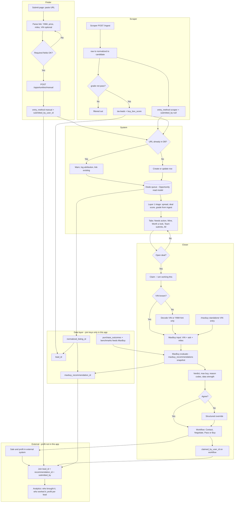

```mermaid
flowchart TB
  subgraph FINDER["Finder"]
    F_SUB["Submit page: paste URL"]
    F_SUB --> F_PARSE["Parse link: YMM, price, miles, VIN optional"]
    F_PARSE --> F_REQ{"Required fields OK?"}
    F_REQ -->|No| F_PARSE
    F_REQ -->|Yes| F_POST["POST /opportunities/manual"]
    F_POST --> F_PROV["entry_method manual + submitted_by_user_id"]
  end

  subgraph SCRAPER["Scraper"]
    S_BATCH["Scraper POST /ingest"]
    S_BATCH --> S_PIPE["raw to normalized to candidate"]
    S_PIPE --> S_GRADE{"grade not pass?"}
    S_GRADE -->|No| S_DROP["filtered out"]
    S_GRADE -->|Yes| S_LEAD["tav.leads + buy_box_score"]
    S_PIPE --> S_PROV["entry_method scraper + submitted_by null"]
  end

  subgraph SYSTEM["System"]
    F_PROV --> DEDUP{"URL already in DB?"}
    S_PROV --> DEDUP
    S_LEAD --> DEDUP
    DEDUP -->|Yes| D_WARN["Warn, log attribution, link existing"]
    DEDUP -->|No| D_CREATE["Create or update row"]
    D_WARN --> QUEUE
    D_CREATE --> QUEUE[("Deals queue - Opportunity read model")]
    QUEUE --> L1["Layer 1 triage: spread, deal score, grade from ingest"]
    L1 --> TABS["Tabs: Needs action, Mine, Worth a look, Team submits, All"]
  end

  subgraph CLOSER["Closer"]
    TABS --> OPEN{"Open deal?"}
    OPEN -->|No| TABS
    OPEN -->|Yes| CLAIM["Claim - I am working this"]
    CLAIM --> VIN{"VIN known?"}
    VIN -->|No| DECODE["Decode VIN or YMM hint only"]
    VIN -->|Yes| MB_IN["MaxBuy input: VIN + ask + miles"]
    DECODE --> MB_IN
    LANE["/maxbuy standalone VIN entry"] --> MB_IN
    MB_IN --> MB["MaxBuy evaluate - maxbuy_recommendations snapshot"]
    MB --> VERDICT["Verdict, max buy, reason codes, data strength"]
    VERDICT --> AGREE{"Agree?"}
    AGREE -->|No| OVR["Structured override"]
    AGREE -->|Yes| WF["Workflow: Contact, Negotiate, Pass or Buy"]
    OVR --> WF
    WF --> CLM["claimed_by_user_id on workflow"]
  end

  subgraph DATA["Data layer - join keys only in this app"]
    PO["purchase_outcomes + benchmarks feeds MaxBuy"]
    NL["normalized_listing_id"]
    LID["lead_id"]
    REC["maxbuy_recommendation_id"]
    PO --> MB
    QUEUE --> NL
    S_LEAD --> LID
    MB --> REC
    NL --> REC
    NL --> LID
  end

  subgraph EXTERNAL["External - profit not in this app"]
    SALE["Sale and profit in external system"]
    JOIN["Join lead_id + recommendation_id + submitted_by"]
    REPORT["Analytics: who brought it, who worked it, profit per lead"]
    WF --> SALE
    SALE --> JOIN
    F_PROV --> JOIN
    CLM --> JOIN
    REC --> JOIN
    JOIN --> REPORT
  end
```
