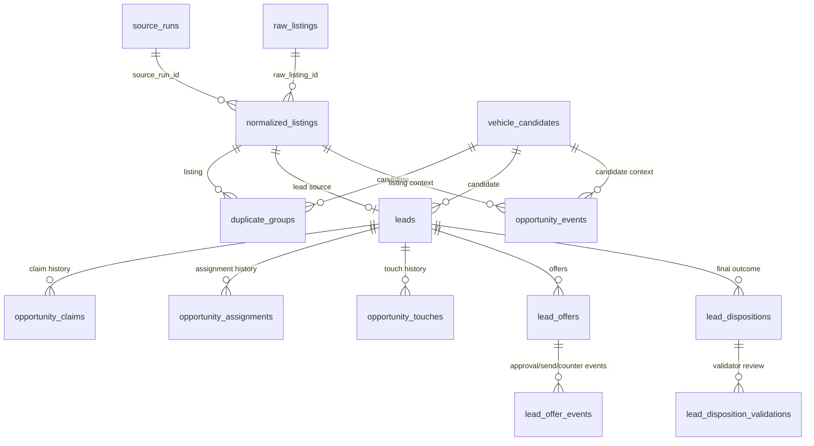

# Data Model — Buying-Side Platform

Status: Draft control doc  
Date: 2026-05-18  
Scope: `V2-Core`, `V2.5`, `V3`, `V3+`

This document maps the v2/v3 functional requirements to the current Supabase
schema and the proposed additive data model. It is a design contract, not a
migration. Real migrations must cite the FR IDs and table sections they
implement.

## Design Principles

- Preserve the four-concept boundary:

```text
raw_listings -> normalized_listings -> vehicle_candidates -> leads
```

- `Opportunity` starts as a product read model, not automatically a fifth
  source-of-truth table.
- Add write tables only where workflow needs durable history: manual
  submissions, claims, assignments, touches, events, offers, dispositions.
- Do not collapse repeated sightings. Preserve source/run identity.
- Estimated mileage/style/MMR must be recorded or returned with explicit
  estimate metadata.
- All new production tables are additive and live under `tav`.

## Current Tables Used by V2

| Table | Purpose today | V2 use | FRs |
|---|---|---|---|
| `tav.source_runs` | One ingestion/scrape run per source/region. | Run identity, first/seen-again context. | FR-001, FR-005 |
| `tav.raw_listings` | Raw upstream payload. | Deep audit/source drill-down. | FR-002, FR-003 |
| `tav.normalized_listings` | Clean listing facts and freshness/change flags. | Core opportunity row facts. | FR-001..010 |
| `tav.vehicle_candidates` | Same-vehicle identity. | Candidate grouping and seen-before context. | FR-005 |
| `tav.duplicate_groups` | Exact/fuzzy duplicate membership. | Duplicate and possible-duplicate badges. | FR-005 |
| `tav.filtered_out` | Rejected/filtered audit trail. | Near-miss opportunities. | FR-004 |
| `tav.valuation_snapshots` | MMR hit/miss snapshots. | MMR, unavailable state, valuation method. | FR-010 |
| `tav.leads` | Created scored leads. | Lead-backed opportunities and existing statuses. | FR-001, FR-018 |
| `tav.buy_box_score_attributions` | Score explanation for leads. | Reason/scoring context. | FR-001, FR-004 |
| `tav.mmr_queries` | MMR lookup audit. | User valuation/evaluation warning. | FR-010, FR-015 |
| `tav.user_activity` | Activity feed/presence. | Helpful context, not workflow truth. | FR-015 |
| `tav.purchase_outcomes` | Historical outcomes. | V3 training context. | FR-029..034 |

## Proposed V2/V3 Tables



## Read Model: `opportunity_read_model`

Milestone: `V2-Core`  
Implementation shape: SQL view, materialized view, or Worker-composed read model.
Do not create a persisted `opportunities` source-of-truth table unless OQ-001 is
decided that way.

### Purpose

Unify existing signals into one product row for `/opportunities`.

### Inputs

- `leads`
- `filtered_out`
- `normalized_listings`
- `vehicle_candidates`
- `duplicate_groups`
- `valuation_snapshots`
- `source_runs`
- `buy_box_score_attributions`
- `mmr_queries`
- future manual submission/claim/assignment/event tables

### Required Output Fields

| Field | Type | Notes | FRs |
|---|---|---|---|
| `opportunity_id` | text | Stable product key, e.g. `lead:{id}`, `near_miss:{id}`, `manual:{id}`. | FR-001 |
| `type` | enum | `lead`, `near_miss`, `repeat_sighting`, `price_update`, `vin_upgrade`, `estimate_update`, `manual_submission`. | FR-001 |
| `badges` | text[] | Event/estimate/status badges. | FR-004..010 |
| `source`, `region` | text | From listing/run/manual submission. | FR-001 |
| `source_run_id` | uuid/text | Preserve run identity. | FR-001, FR-005 |
| `normalized_listing_id` | uuid? | Nullable for manual-only rows. | FR-001 |
| `vehicle_candidate_id` | uuid? | Candidate context. | FR-005 |
| `lead_id` | uuid? | Nullable for non-lead opportunities. | FR-001 |
| `title`, `year`, `make`, `model`, `trim`, `vin` | mixed | Vehicle identity. | FR-002 |
| `price`, `mileage` | integer? | Explicit source values when known. | FR-002 |
| `mileage_estimated`, `style_estimated`, `mmr_estimated` | boolean | Must drive UI badges. | FR-008..010 |
| `mmr_value`, `mmr_method`, `mmr_missing_reason` | mixed | From valuation snapshots/MMR routes. | FR-010 |
| `spread` | integer? | `mmr_value - price` only when both exist. | FR-010 |
| `final_score`, `grade`, `reason_codes` | mixed | Score context. | FR-001, FR-004 |
| `finder_user_id`, `finder_name` | text? | From manual submission/future event. | FR-011 |
| `assigned_to_user_id`, `assigned_to_name` | text? | Latest assignment. | FR-013, FR-017 |
| `claimed_by_user_id`, `claimed_at`, `claim_expires_at` | mixed | Latest active claim. | FR-014..016 |
| `first_seen_at`, `last_seen_at`, `seen_count` | mixed | Candidate/listing recency. | FR-005 |

### Indexing Strategy

If implemented as a materialized view or table later, optimize for:

- `status/type`
- `last_seen_at DESC`
- `claim_expires_at`
- `assigned_to_user_id`
- `vehicle_candidate_id`
- `source_run_id`

## V2-Core Write Tables

### `tav.manual_opportunity_submissions`

Milestone: `V2-Core`  
FRs: FR-011, FR-012, FR-013

Purpose: durable record of human-submitted links and optional facts.

```sql
CREATE TABLE tav.manual_opportunity_submissions (
  id uuid PRIMARY KEY DEFAULT gen_random_uuid(),
  listing_url text NOT NULL,
  submitted_by_user_id text NOT NULL,
  submitted_by_name text,
  submitted_by_email text,
  assigned_to_user_id text,
  assigned_to_name text,
  source text,
  region text,
  year smallint CHECK (year BETWEEN 1900 AND 2100),
  make text,
  model text,
  trim text,
  vin text,
  price integer CHECK (price >= 0),
  mileage integer CHECK (mileage >= 0),
  seller_notes text,
  context_notes text,
  matched_normalized_listing_id uuid REFERENCES tav.normalized_listings(id),
  matched_vehicle_candidate_id uuid REFERENCES tav.vehicle_candidates(id),
  created_at timestamptz NOT NULL DEFAULT now(),
  updated_at timestamptz NOT NULL DEFAULT now()
);
```

Indexes:

- `(created_at DESC)`
- `(assigned_to_user_id) WHERE assigned_to_user_id IS NOT NULL`
- `(matched_vehicle_candidate_id) WHERE matched_vehicle_candidate_id IS NOT NULL`
- unique or soft-unique on `(listing_url, submitted_by_user_id)` is optional;
  do not block duplicate submissions until OQ-007 is decided.

### `tav.opportunity_events`

Milestone: `V2.5` if broad event substrate, `V2-Core` only if needed for manual
submission/duplicate warnings.  
FRs: FR-005, FR-006, FR-007, FR-015, FR-023

Purpose: append-only timeline for product events that are not source-of-truth
tables themselves.

```sql
CREATE TABLE tav.opportunity_events (
  id uuid PRIMARY KEY DEFAULT gen_random_uuid(),
  opportunity_key text NOT NULL,
  event_type text NOT NULL,
  actor_user_id text,
  actor_name text,
  normalized_listing_id uuid REFERENCES tav.normalized_listings(id),
  vehicle_candidate_id uuid REFERENCES tav.vehicle_candidates(id),
  lead_id uuid REFERENCES tav.leads(id),
  source_run_id uuid REFERENCES tav.source_runs(id),
  payload jsonb NOT NULL DEFAULT '{}',
  created_at timestamptz NOT NULL DEFAULT now()
);
```

Suggested `event_type` values:

- `first_seen`
- `seen_again`
- `price_changed`
- `vin_appeared`
- `mileage_changed`
- `manual_submitted`
- `mmr_evaluated`
- `claim_conflict_viewed`

### `tav.opportunity_claims`

Milestone: `V2-Core`  
FRs: FR-014, FR-015, FR-016

Purpose: claim ownership history and 24-hour working windows.

```sql
CREATE TABLE tav.opportunity_claims (
  id uuid PRIMARY KEY DEFAULT gen_random_uuid(),
  opportunity_key text NOT NULL,
  lead_id uuid REFERENCES tav.leads(id),
  manual_submission_id uuid REFERENCES tav.manual_opportunity_submissions(id),
  claimed_by_user_id text NOT NULL,
  claimed_by_name text,
  claimed_at timestamptz NOT NULL DEFAULT now(),
  expires_at timestamptz NOT NULL,
  released_at timestamptz,
  release_reason text,
  created_at timestamptz NOT NULL DEFAULT now()
);
```

Constraint/index strategy:

- Partial unique active claim index:
  `(opportunity_key) WHERE released_at IS NULL AND expires_at > now()` cannot use
  `now()` in a stable partial index. Implement active-claim concurrency in a DB
  function or use an explicit `status` column with partial unique
  `(opportunity_key) WHERE status = 'active'`.
- Recommended addition:
  `status text CHECK (status IN ('active','released','expired','superseded'))`.

### `tav.opportunity_assignments`

Milestone: `V2-Core`  
FRs: FR-013, FR-017

Purpose: explicit closer routing history.

```sql
CREATE TABLE tav.opportunity_assignments (
  id uuid PRIMARY KEY DEFAULT gen_random_uuid(),
  opportunity_key text NOT NULL,
  lead_id uuid REFERENCES tav.leads(id),
  manual_submission_id uuid REFERENCES tav.manual_opportunity_submissions(id),
  assigned_to_user_id text NOT NULL,
  assigned_to_name text,
  assigned_by_user_id text NOT NULL,
  assigned_by_name text,
  reason text,
  superseded_at timestamptz,
  created_at timestamptz NOT NULL DEFAULT now()
);
```

Indexes:

- `(opportunity_key, created_at DESC)`
- `(assigned_to_user_id) WHERE superseded_at IS NULL`

## V2.5 Tables

### `tav.opportunity_touches`

Milestone: `V2.5`  
FRs: FR-020

Purpose: calls, SMS, email, notes, contact attempts, and outcomes.

Key columns:

- `id`
- `opportunity_key`
- `lead_id`
- `manual_submission_id`
- `touch_type` (`call`, `sms`, `email`, `note`, `other`)
- `outcome`
- `body`
- `actor_user_id`, `actor_name`
- `created_at`

Indexes:

- `(opportunity_key, created_at DESC)`
- `(actor_user_id, created_at DESC)`

### `tav.staff_availability`

Milestone: `V2.5`  
FRs: FR-021

Purpose: on-duty/off-duty readiness for later approval routing.

Key columns:

- `user_id` primary key
- `user_name`, `user_email`
- `status` (`on_duty`, `off_duty`, `away`)
- `status_until`
- `updated_by_user_id`
- `updated_at`

## V3 Tables

### `tav.lead_offers`

Milestone: `V3`  
FRs: FR-024, FR-025, FR-026, FR-028  
ADR: `ADR-0001`

Purpose: customer-facing offer and approval gate record.

Key columns:

- `id`
- `lead_id` or `opportunity_key`
- `seq`
- `amount`
- `status` (`draft`, `pending_approval`, `approved`, `rejected`, `sent`,
  `superseded`, `expired`, `accepted`, `declined`)
- `submitted_by_user_id`
- `required_approver_tier`
- `approved_by_user_id`
- `approved_at`
- `rejected_by_user_id`
- `rejected_at`
- `rejection_reason`
- `sent_at`
- `expires_at`
- `superseded_by_offer_id`
- `created_at`

This table records offer-level audit only. Full approval analytics belong to
`V3+` after the shared event substrate exists.

### `tav.lead_counters`

Milestone: `V3`  
FRs: FR-027

Purpose: customer counters as first-class negotiation records.

Key columns:

- `id`
- `lead_id` or `opportunity_key`
- `related_offer_id`
- `amount`
- `source` (`customer`, `closer`, `system`)
- `recorded_by_user_id`
- `notes`
- `created_at`

### `tav.lead_dispositions`

Milestone: `V3`  
FRs: FR-029

Purpose: final outcome for training/calibration.

Key columns:

- `id`
- `lead_id` or `opportunity_key`
- `disposition_type`
- `reason_code`
- `closer_initial_grade`
- `closer_final_grade`
- `amount_context`
- `notes`
- `created_by_user_id`
- `created_at`
- `corrected_by_user_id`
- `corrected_at`

Disposition rows should be immutable except admin correction fields.

### `tav.lead_disposition_validations`

Milestone: `V3`  
FRs: FR-030

Purpose: validator review of disposition quality.

Key columns:

- `id`
- `disposition_id`
- `validator_user_id`
- `result` (`approved`, `overridden`, `disputed`)
- `override_grade`
- `override_reason`
- `created_at`

## V3+ Tables / Views

| Object | Purpose | FRs |
|---|---|---|
| `approval_sla_events` or event view | Track missed/approaching approval SLA. | FR-032 |
| `approval_delegations` | Delegated approval authority. | FR-033 |
| `v_approval_analytics` | Admin-only approval/submitter frequency and drift. | FR-034 |
| `v_disposition_quality` | Calibration and validation reporting. | FR-034 |

## Migration Sequence

| Step | Milestone | Migration intent | Enables |
|---:|---|---|---|
| 1 | `V2-Core` | No schema if `opportunity_read_model` is Worker-composed. Optional view/materialized view only. | FR-001..010 |
| 2 | `V2-Core` | `manual_opportunity_submissions`. | FR-011..013 |
| 3 | `V2-Core` | `opportunity_claims`, `opportunity_assignments`, minimal event rows if needed. | FR-014..017 |
| 4 | `V2.5` | `opportunity_touches`, `staff_availability`, shared `opportunity_events`. | FR-020..023 |
| 5 | `V3` | `lead_offers`, `lead_counters`. | FR-024..028 |
| 6 | `V3` | `lead_dispositions`, `lead_disposition_validations`. | FR-029..030 |
| 7 | `V3+` | Analytics/delegation/SLA tables and views. | FR-032..034 |

## Open Schema Decisions

These must be resolved before writing migrations:

- OQ-001: read model only vs persisted `opportunities` table.
- OQ-004: active claim uniqueness model and auto-release vs eligible state.
- OQ-006: minimum manual submission payload.
- OQ-007: duplicate manual submission behavior.
- OQ-008: who can assign during first live testing.
- OQ-023: initial/final grade split for dispositions.

## First Code PR Data Boundary

The first v2 code PR should not add write tables. It should compose the
read-only Opportunities model from existing tables and prove the shape with
tests. If performance requires persistence, create a read-model view or
materialized view in a separate docs-approved PR.

