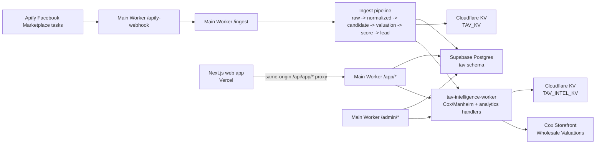
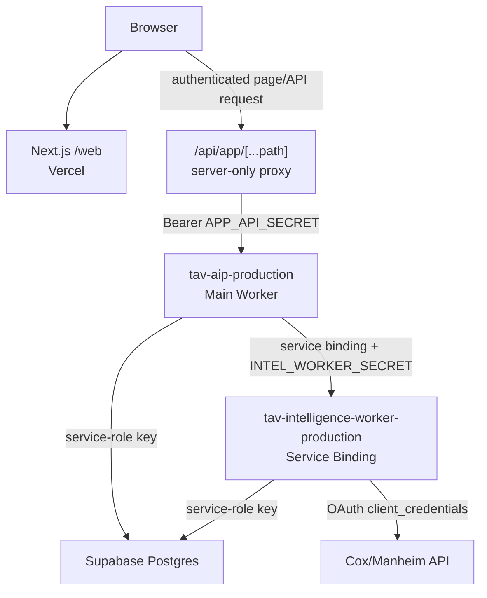
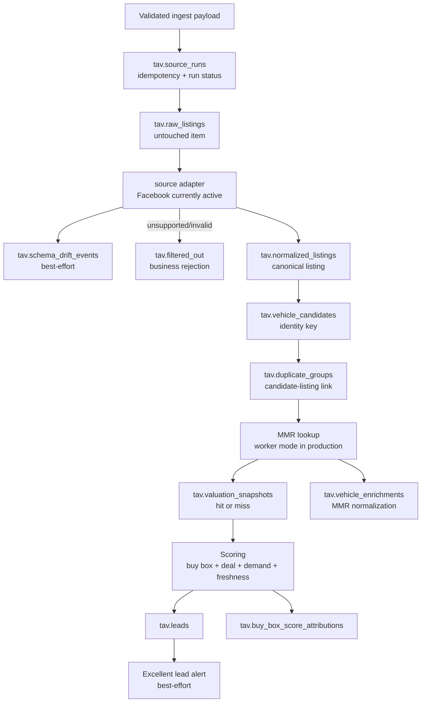
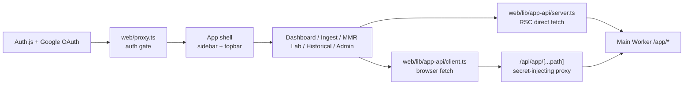

# Current Architecture Map

Status: Active current-state reference  
Date: 2026-05-18  
Scope: What exists on `main` today, not the v2 target design

This map is the bridge between the current TAV-AIP system and the v2/v3 platform
requirements. Use it before designing new schema, routes, state machines, or UX.
It intentionally separates what is live today from what the platform docs still
need to define.

## 1. Executive Map

Current runtime has three main execution surfaces:

| Surface | Runtime | Primary responsibility |
|---|---|---|
| Main Worker | Cloudflare Worker, `src/index.ts` | Ingest, app API, admin API, stale sweep, Supabase persistence, intel-worker proxying. |
| Intelligence Worker | Cloudflare Worker, `workers/tav-intelligence-worker/src/index.ts` | Cox/Manheim credentials, MMR catalog, VIN/YMM valuation, MMR query/cache analytics. |
| Web app | Next.js App Router, `web/` | Authenticated dashboard, MMR Lab, ingest monitor, historical/admin screens, server-side proxy to `/app/*`. |

## 2. Runtime Boundaries

Boundary rules currently enforced:

| Rule | Current implementation |
|---|---|
| Browser never receives Worker secrets | `web/app/api/app/[...path]/route.ts` injects `APP_API_SECRET` server-side. |
| Browser never calls Cox/Manheim directly | MMR calls go browser -> Next proxy -> main Worker -> intelligence Worker -> Cox. |
| Cox credentials stay in the intelligence Worker | `workers/tav-intelligence-worker/src/clients/manheimHttp.ts` owns token and Cox calls. |
| App API is lower blast-radius than admin API | `/app/*` uses `APP_API_SECRET`; `/admin/*` uses `ADMIN_API_SECRET`. |
| Main-to-intel auth is service-secret based | Main Worker sends `x-tav-service-secret`; intelligence Worker injects service identity. |

## 3. Deployed Components

| Component | Config | Production name / host | Notes |
|---|---|---|---|
| Main Worker | `wrangler.toml` | `tav-aip-production` | Production env uses `MANHEIM_LOOKUP_MODE=worker`, service binding `INTEL_WORKER`, and `APIFY_WEBHOOK_ENABLED=true`. |
| Intelligence Worker | `workers/tav-intelligence-worker/wrangler.toml` | `tav-intelligence-worker-production` | Owns `TAV_INTEL_KV`; public `workers_dev` intended to remain off at steady state. |
| Web app | `web/` | Vercel app `tav-enterprise` | Auth.js + Google OAuth; same-origin app API proxy. |
| Database | `supabase/schema.sql` + migrations | Supabase project, schema `tav` | Service-role access from Workers only. |
| KV | Cloudflare KV | `TAV_KV`, `TAV_INTEL_KV` | Main Worker KV for valuation/DLQ overflow; intelligence KV for token/cache behavior. |

## 4. Main Worker Route Map

Implementation entry point: `src/index.ts`

| Route | Handler | Auth | Current purpose |
|---|---|---|---|
| `GET /health` | `handleHealth` | none | Basic service health/version. |
| `POST /ingest` | `src/ingest/handleIngest.ts` | HMAC `x-tav-signature` | Primary ingestion endpoint. |
| `POST /apify-webhook` | `src/apify/webhookHandler.ts` | Apify webhook secret + feature flag | Fetches Apify dataset and calls ingest core. |
| `/admin/*` | `src/admin/routes.ts` | `ADMIN_API_SECRET` bearer | Ops/admin routes, import/outcome/market/admin intel proxy. |
| `/app/*` | `src/app/routes.ts` | `APP_API_SECRET` bearer | Product API consumed by web app. |

### `/app/*` implemented routes

| Method | Path | Source |
|---|---|---|
| `GET` | `/app/system-status` | Supabase source health + stale sweep + intel worker wiring. |
| `GET` | `/app/kpis` | Outcomes/leads/listings KPI blocks. |
| `GET` | `/app/import-batches` | Outcome import batches. |
| `GET` | `/app/historical-sales` | Historical sales table. |
| `GET` | `/app/ingest-runs` | Source/ingest run list. |
| `GET` | `/app/ingest-runs/:id` | Source/ingest run detail. |
| `POST` | `/app/mmr/vin` | VIN valuation proxy to intelligence Worker. |
| `POST` | `/app/mmr/ymm` | YMM/style/mileage valuation proxy to intelligence Worker. |
| `GET` | `/app/mmr/catalog/years` | MMR catalog years proxy. |
| `GET` | `/app/mmr/catalog/makes?year=` | MMR catalog makes proxy. |
| `GET` | `/app/mmr/catalog/models?year=&make=` | MMR catalog models proxy. |
| `GET` | `/app/mmr/catalog/styles?year=&make=&model=` | MMR catalog styles proxy. |

### `/admin/*` notable routes

| Method | Path | Current purpose |
|---|---|---|
| `GET` | `/admin/valuations/contract-probe` | Redacted proxy to intelligence Worker contract probe. |
| `POST` | `/admin/import-outcomes` | Imports purchase/outcome rows. |
| `GET` | `/admin/outcomes/dashboard` | Reads outcome summary view. |
| `GET`/`PUT` | `/admin/market/expenses` | Reads/writes regional market expense assumptions. |
| `GET` | `/admin/market/demand` | Reads market demand index. |
| `POST` | `/admin/market/demand/recompute` | Recomputes demand index from outcomes. |

## 5. Intelligence Worker Route Map

Implementation entry point: `workers/tav-intelligence-worker/src/routes/index.ts`

| Method | Path | Purpose |
|---|---|---|
| `GET` | `/health` | Intelligence worker health. |
| `POST` | `/mmr/vin` | VIN MMR lookup. |
| `POST` | `/mmr/year-make-model` | YMM/style/mileage MMR lookup. |
| `GET` | `/catalog/years` | Cox MMR catalog years. |
| `GET` | `/catalog/years/:year/makes` | Cox MMR catalog makes. |
| `GET` | `/catalog/years/:year/makes/:make/models` | Cox MMR catalog models. |
| `GET` | `/catalog/years/:year/makes/:make/models/:model/styles` | Cox MMR catalog styles/trims. |
| `GET` | `/admin/valuations/contract-probe` | Redacted production contract probe. |
| `POST` | `/sales/upload` | Sales upload path. |
| `GET` | `/kpis/summary` | KPI summary. |
| `GET` | `/activity/feed` | User activity feed. |
| `GET` | `/activity/vin/:vin` | VIN-specific activity. |
| `GET` | `/intel/mmr/queries` | MMR query analytics. |
| `GET` | `/intel/mmr/:cacheKey` | MMR cache-key detail. |

## 6. Ingestion Pipeline

Current ingest behavior:

| Step | Current implementation |
|---|---|
| Auth | HMAC on `/ingest`; Apify bridge uses its own webhook auth and then calls ingest core. |
| Idempotency | `source_runs` prevents reprocessing completed source runs. |
| Raw preservation | Every attempted item is inserted into `raw_listings` before normalization. |
| Adapter | Facebook adapter is active; unsupported sources are filtered out. |
| Drift | Facebook shape drift is best-effort and non-blocking. |
| Dedupe | Listing links to a `vehicle_candidate` through `duplicate_groups`; failures are non-fatal. |
| MMR | Production main Worker is configured for intelligence-worker mode. |
| Scoring | Deal, buy box, freshness, source confidence, region, hybrid buy-box, segment profit, and demand feed lead scores. |
| Deadline | Per-run loop is deadline-aware and truncates before Worker runtime cancellation. |

## 7. Current Data Model Clusters

The schema is still v1/v1.5 oriented. v2 Opportunities must be designed as a
controlled extension instead of mutating `leads` into a catch-all concept.

| Cluster | Current tables/views | Role today |
|---|---|---|
| Source/run audit | `source_runs`, `raw_listings`, `schema_drift_events`, `filtered_out`, `dead_letters`, `cron_runs`, `v_source_health` | Ingest observability, rejection tracking, operational health. |
| Listing identity | `normalized_listings`, `vehicle_candidates`, `duplicate_groups` | Four-concept boundary and duplicate grouping. |
| Valuation | `valuation_snapshots`, `mmr_queries`, `mmr_cache`, `mmr_reference_*`, `vehicle_enrichments` | MMR result/miss persistence, query analytics, enrichment payloads. |
| Scoring | `buy_box_rules`, `buy_box_score_attributions`, `market_demand_index`, `market_velocities` | Lead grading and score explanations. |
| Buyer-facing v1 | `leads`, `lead_actions`, `v_active_inbox` | Current lead queue concept; insufficient for full v2 Opportunities without additions. |
| Outcomes/history | `purchase_outcomes`, `import_batches`, `import_rows`, `sales_upload_batches`, `historical_sales`, `v_outcome_summary`, `v_outcome_summary_global`, `v_segment_profit` | Purchase/sale outcomes, imports, historical sales, performance analytics. |
| Activity | `user_activity` | MMR/search/activity feed. |

## 8. Web App Map

Current pages:

| Page | File | Current role |
|---|---|---|
| Dashboard | `web/app/(app)/dashboard/page.tsx` | KPI/product dashboard. |
| Ingest | `web/app/(app)/ingest/page.tsx` | Ingest monitor routes via `/app/ingest-runs`. |
| MMR Lab | `web/app/(app)/mmr-lab/page.tsx` | Live catalog cascade, VIN/YMM valuation, Manheim-faithful result surface. |
| Historical | `web/app/(app)/historical/page.tsx` | Historical sales view. |
| Admin | `web/app/(app)/admin/page.tsx` | Operational status and admin integrations. |
| Sign in | `web/app/(auth)/signin/page.tsx` | Auth entry. |

MMR Lab current behavior:

| Behavior | Current state |
|---|---|
| VIN valuation | Calls `/api/app/mmr/vin`, which proxies to `/app/mmr/vin`. |
| Catalog dropdowns | Calls `/api/app/mmr/catalog/*`, backed by Cox Storefront catalog through intelligence Worker. |
| YMM valuation | Requires selected year/make/model/style and mileage before calling `/api/app/mmr/ymm`. |
| Estimated values | Missing mileage/style estimation is handled in the web flow and visibly badged. |
| Rich MMR detail | Base MMR and some averages are shown; not all Manheim UI panels have full backend data yet. |

## 9. External Integrations

| Integration | Direction | Current use |
|---|---|---|
| Apify | Apify -> main Worker | Facebook Marketplace task output via webhook/dataset bridge. |
| Cox/Manheim | intelligence Worker -> Cox | MMR catalog, VIN valuation, YMM/style/mileage valuation. |
| Supabase | Workers -> Supabase | Primary relational data store, service-role access from Workers. |
| Cloudflare KV | Workers -> KV | MMR cache/token/cache-adjacent behavior and overflow support. |
| Vercel | GitHub/main -> web deploy | Hosts Next.js web app. |
| Google OAuth / Auth.js | Browser/web | Staff sign-in. |
| GitHub Actions | GitHub | CI, secret scan, TAV gates, reviewer checks. |

## 10. Current Operational Jobs

| Job | Trigger | Implementation | Writes |
|---|---|---|---|
| Stale sweep | Cloudflare cron `0 6 * * *` | `src/index.ts` scheduled handler -> `runStaleSweep` | `cron_runs`, stale-related listing/lead fields. |
| Apify runs | Apify schedule/web/manual | Apify Actor task; then `/apify-webhook`/`/ingest` | Source runs, raw/normalized/candidates/leads/etc. |
| Web deploy | Vercel on GitHub main | Vercel project | Web deployment only. |
| Worker deploy | Manual | `npm run deploy`, `npm run deploy:intelligence` | Cloudflare Workers. |

## 11. Auth And Secret Boundaries

| Boundary | Secret / identity | Notes |
|---|---|---|
| `/ingest` | `WEBHOOK_HMAC_SECRET` | HMAC over raw request body. |
| `/apify-webhook` | `APIFY_WEBHOOK_SECRET`, `APIFY_TOKEN` | Webhook route can fetch Apify dataset. |
| `/app/*` | `APP_API_SECRET` | Lower-blast product API secret, injected by Next server. |
| `/admin/*` | `ADMIN_API_SECRET` | Ops-grade admin secret. |
| main Worker -> intel Worker | `INTEL_WORKER_SECRET` / `INTEL_SERVICE_SECRET` | Shared service header; preferred over public fetch. |
| intelligence Worker -> Cox | `MANHEIM_*` secrets | OAuth client credentials; never browser-exposed. |
| Workers -> Supabase | `SUPABASE_SERVICE_ROLE_KEY` | Worker-only. |
| Web auth | `AUTH_*`, Google OAuth | User session gate for web pages and `/api/app/*`. |

## 12. Current Gaps That Matter For V2

These are not defects in the current system; they are the seams v2 must handle
explicitly.

| Gap | Why it matters for v2 | Likely doc owner |
|---|---|---|
| `leads` is not enough for the requested Opportunity workflow | v2 needs near-misses, repeats, price changes, VIN appeared, estimates, manual submissions, and multiple run-relevant rows. | `02-functional-requirements.md`, `03-data-model.md` |
| Current assignment fields are light | `assigned_to`, `assigned_at`, and `lock_expires_at` exist, but claim ownership, 24-hour windows, finder/closer semantics, and reassignment audit need a real state model. | `04-state-machines.md`, `12-security-and-access.md` |
| `lead_actions` is generic | It can record notes/actions, but v2 touches/contact attempts need structured payloads and consistent actor/time/source semantics. | `03-data-model.md`, `05-api-contract.md` |
| Duplicate/repeat identity exists below the lead layer | `vehicle_candidates` and `duplicate_groups` exist, but the buyer queue needs a deliberate "seen before / price changed / VIN appeared" presentation model. | `02-functional-requirements.md`, `06-ux-spec.md` |
| Manual opportunity submission is planned but not implemented | Buyers need to submit links and optionally assign closers. | `02-functional-requirements.md`, `05-api-contract.md`, `06-ux-spec.md` |
| Role/tier model is not yet first-class in the database | Current web auth knows a user session, but v2/v3 needs buyer/closer/admin and later junior/senior approval behavior. | `12-security-and-access.md`, `03-data-model.md` |
| Offer/approval/disposition tables do not exist yet | `lead_offers`, `lead_touches`, `lead_dispositions`, and `lead_events` are v3 platform additions, not current tables. | `03-data-model.md`, `04-state-machines.md` |
| Current docs still have historical architecture material | This file is current-state; older long-form docs may describe target or historical behavior. Use the source hierarchy in `README.md`. | `06-platform/README.md` |

## 13. How To Use This Map For V2

Before writing the next v2 PR:

1. Choose the exact `V2-Core` capability.
2. Locate the current surface it touches in this map.
3. Add or update the traceability docs:
   - `02-functional-requirements.md`
   - `03-data-model.md`
   - `04-state-machines.md`
   - `05-api-contract.md`
   - `06-ux-spec.md`
   - `09-test-strategy.md`
4. State whether the work extends an existing concept or introduces a new one.
5. Do not collapse Raw Listing, Normalized Listing, Vehicle Candidate, Lead, and
   future Opportunity into a single table or UI concept.

The practical reading: the current system is strong at ingest, valuation, scoring,
and operational visibility. The v2 build should add accountable human workflow on
top of that foundation without damaging the existing ingest/identity layers.
