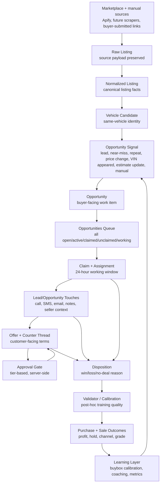
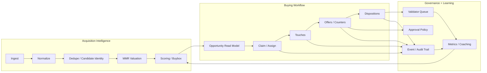
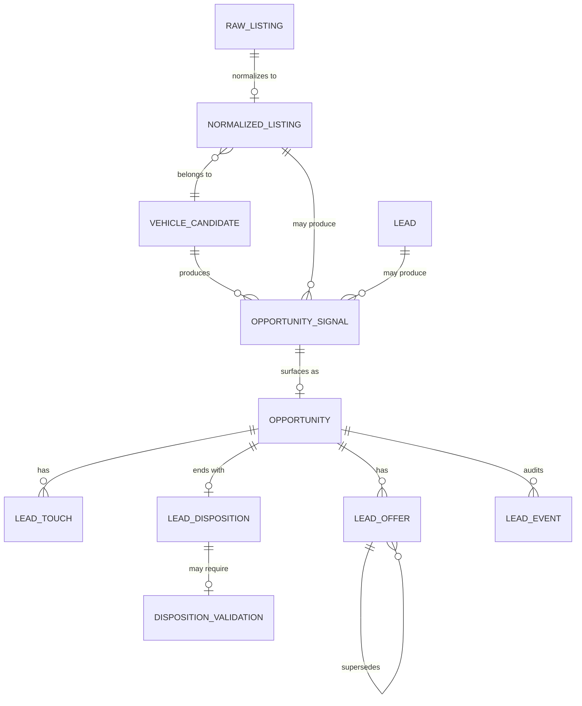
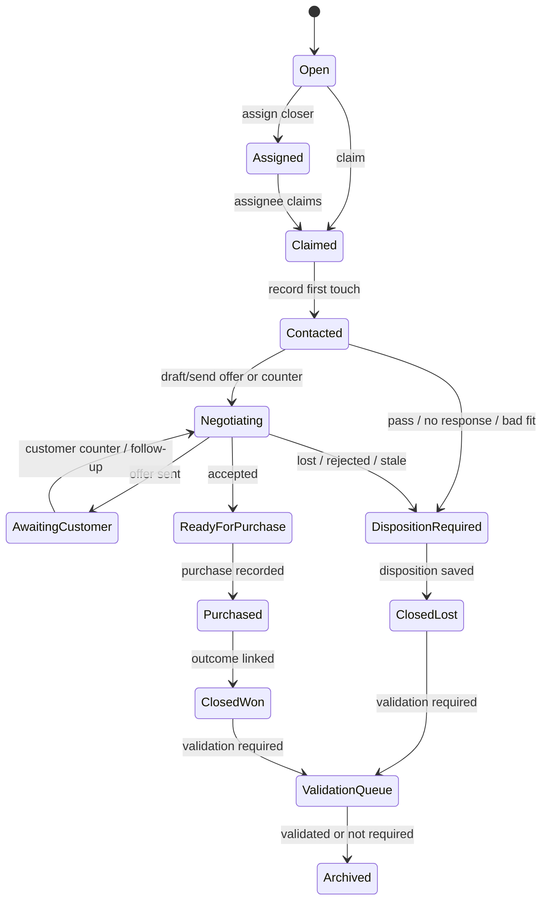
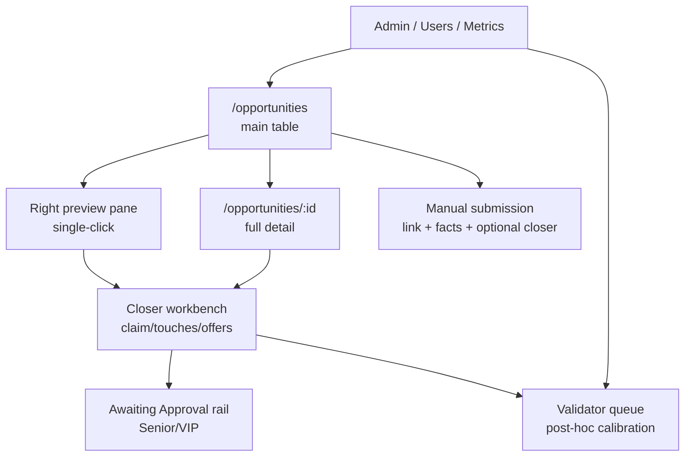
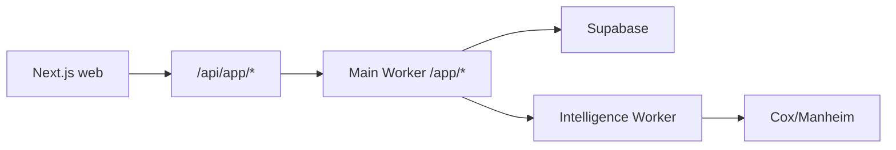
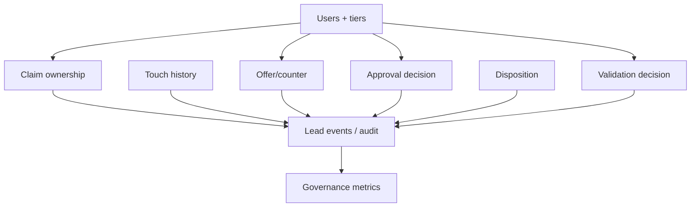
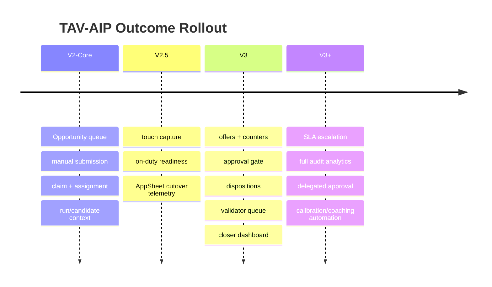

# Final Project Outcome Architecture Map

Status: Target outcome map  
Date: 2026-05-18  
Scope: Intended buying-side platform architecture after v2/v3 are complete

This document describes the final project shape the current system is moving
toward. It is not a claim that every box exists today. For current-state reality,
see [15-current-architecture-map.md](15-current-architecture-map.md).

Use this map to keep implementation aligned with the broader outcome while still
building in milestone order.

## 1. North Star

TAV-AIP becomes the internal buying-side operating system for Texas Auto Value:

```text
marketplace signal
  -> normalized vehicle identity
  -> valuation and buybox context
  -> Opportunity
  -> claim / assignment
  -> touch history
  -> offer / approval / counter loop
  -> disposition / validation
  -> outcome learning
  -> better future opportunity decisions
```

The final architecture keeps the existing data-intelligence foundation, then adds
accountable human workflow on top of it. The platform should not become a giant
single-table lead tracker. It should preserve clean source concepts and expose a
buyer-facing Opportunity layer.

## 2. Final End-To-End System



## 3. Final Layered Architecture



The clean separation:

| Layer | Final responsibility | Must not do |
|---|---|---|
| Acquisition intelligence | Source ingestion, normalization, identity, valuation, scoring. | Own human workflow state. |
| Opportunity layer | Present actionable buyer work from many signals. | Replace raw/normalized/candidate/lead source truth. |
| Workflow layer | Claim, assign, contact, offer, counter, dispose. | Fabricate seller, user, or valuation facts. |
| Governance layer | Approval, validation, audit, metrics, coaching. | Block early v2 if dependencies are not ready. |
| Learning layer | Improve buybox and training from validated outcomes. | Retrain from unvalidated dispositions. |

## 4. Final Core Concepts



Target concept vocabulary:

| Concept | Final meaning |
|---|---|
| Raw Listing | Untouched source payload from scraper/manual source. |
| Normalized Listing | Canonical facts extracted from a raw/source item. |
| Vehicle Candidate | Same-vehicle identity grouping across listings/runs/sources. |
| Lead | Existing scored system-created record tied to a normalized listing. |
| Opportunity Signal | Reason something should surface: lead, near-miss, repeat, price change, VIN appeared, estimate update, manual submission. |
| Opportunity | Buyer-facing work item/read model that a user can see, claim, assign, and work. |
| Lead Touch | Structured contact or context event during work. |
| Lead Offer | Customer-facing offer/counter term record with approval state. |
| Lead Disposition | Final business outcome for a worked opportunity. |
| Lead Event | Shared audit/event substrate across workflow actions. |

## 5. Final User Workflow



Final user modes:

| Mode | Primary user question | Platform answer |
|---|---|---|
| Hunting | What should I work next? | Ranked Opportunities queue with badges, spread, score, source/run context. |
| Working | What am I doing with this seller now? | Claimed Opportunity detail, touch history, seller/listing facts, prior sightings. |
| Awaiting | What offers/counters are live? | Offer countdowns, counter thread, pending customer/approver state. |
| Disposing | What happened and what should we learn? | Forced disposition form, grade/outcome snapshot, validation routing. |
| Managing | Who owns what and where are bottlenecks? | Active closers, pending approvals, stale claims, validator queue, metrics. |

## 6. Final UI Surface Map



Final screens:

| Surface | Final purpose |
|---|---|
| `/opportunities` | One queue for open, active, claimed, unclaimed, working Opportunities. |
| Preview pane | Fast evaluation: listing, MMR, spread, badges, prior sightings, owner, next action. |
| `/opportunities/:id` | Full source/identity/valuation/workflow/touch/offer/disposition history. |
| Manual submission | Buyer/finder submits listing URL, relevant facts, and optional closer assignment. |
| Closer workbench | Claim, contact, record touch, draft offer, log counter, dispose. |
| Approval rail | Senior/VIP review of pending customer-facing offers. |
| Validator queue | Post-hoc validation and coaching data capture. |
| Admin metrics | Queue health, approval bottlenecks, validator disagreement, closer performance. |

## 7. Final Data Architecture By Milestone

| Milestone | Final schema/read-model outcome |
|---|---|
| `V2-Core` | Opportunity read model, manual submissions, claim/assignment fields or tables, visible run/candidate context, estimate badges. |
| `V2.5` | Structured touches, on-duty/off-duty readiness, stronger event/audit substrate, AppSheet cutover telemetry. |
| `V3` | `lead_offers`, customer counters, approval gate, `lead_dispositions`, validator queue, closer dashboard. |
| `V3+` | Full audit analytics, approval SLA timers, delegated approval, fraud/collusion analytics, calibration/coaching loops. |

Likely final tables or views that do not all exist today:

| Object | Type | Milestone | Purpose |
|---|---|---|---|
| `v_opportunities` or `opportunities` | View/read model or table | `V2-Core` | Buyer-facing queue across leads, near-misses, repeats, price/VIN/estimate events, manual submissions. |
| `manual_opportunity_submissions` | Table | `V2-Core` | Buyer/finder submitted links and facts. |
| `opportunity_claims` or claim columns/events | Table/columns | `V2-Core` | 24-hour claim ownership and concurrency. |
| `lead_touches` | Table | `V2.5` | Contact attempts, notes, seller context, follow-up signals. |
| `lead_events` | Table | `V2.5`/`V3` | Shared audit substrate across claim/touch/offer/status/disposition. |
| `users` / `user_roles` | Table | `V2.5`/`V3` | Staff identity, closer tier, on-duty state, permissions. |
| `lead_offers` | Table | `V3` | Offer/counter thread and approval status. |
| `lead_dispositions` | Table | `V3` | Final outcome and training data. |
| `disposition_validations` or validation fields | Table/columns | `V3` | Validator decisions and coaching. |

These names are target-oriented. The actual data model must be finalized in
`03-data-model.md` before code.

## 8. Final API Architecture



Target `/app/*` API groups:

| Group | Example routes | Milestone |
|---|---|---|
| Opportunity reads | `GET /app/opportunities`, `GET /app/opportunities/:id` | `V2-Core` |
| Manual submission | `POST /app/opportunities/manual` | `V2-Core` |
| Claim/assignment | `POST /app/opportunities/:id/claim`, `/assign`, `/release` | `V2-Core` |
| Status/notes | `POST /app/opportunities/:id/status`, `/notes` | `V2-Core`/`V2.5` |
| Touches | `POST /app/opportunities/:id/touches`, `GET /.../touches` | `V2.5` |
| Offers/counters | `POST /app/opportunities/:id/offers`, `POST /app/offers/:id/approve` | `V3` |
| Dispositions | `POST /app/opportunities/:id/disposition` | `V3` |
| Validation | `GET /app/validation/dispositions`, `POST /app/validation/:id` | `V3` |
| Metrics | `GET /app/metrics/queue`, `/metrics/approvals`, `/metrics/calibration` | `V3`/`V3+` |

API rules:

- Every write is server-authorized and auditable.
- Claim and assignment writes are concurrency-safe.
- No browser-to-Cox/Manheim calls.
- No route returns fabricated users, MMR, seller facts, or workflow state.
- Estimated values must carry explicit estimate flags in API responses.
- Every API route must trace to FR IDs before implementation.

## 9. Final Governance Architecture



Progressive governance:

| Feature | Final role | Earliest milestone |
|---|---|---|
| Offer-level approval audit | Prove who submitted, who approved/rejected, amount, timestamps, reason. | `V3` |
| Shared `lead_events` audit | Explain lifecycle across claim/touch/status/offer/disposition. | `V2.5`/`V3` |
| Approval SLA timers | Prevent customer-facing delay when approvers are offline. | `V3+` |
| Delegated approval | Temporary approval authority with explicit limits and audit. | `V3+` |
| Fraud/collusion analytics | Detect suspicious approver/submitter patterns and approval-to-outcome drift. | `V3+` |

## 10. Final Metrics Architecture

Final platform should answer four operating questions:

| Question | Metric examples | Milestone |
|---|---|---|
| Are we finding enough opportunities? | Leads/near-misses/manual submissions per source/region/hour. | `V2-Core` |
| Are people working them fast enough? | Time to claim, time to first touch, expired claims, queue age. | `V2-Core`/`V2.5` |
| Are approvals slowing deals? | Time from offer draft to approval/sent, pending approval queue age. | `V3` |
| Are decisions improving? | Grade-vs-outcome agreement, validator overrides, spread vs final outcome, closer coaching signals. | `V3`/`V3+` |

North-star metric from the platform review:

```text
time from opportunity claimed to first customer-facing offer sent
```

Track p50 and p95 once offers exist. Before offers exist, use:

```text
time from opportunity surfaced to first claim
time from claim to first touch
```

## 11. Final Rollout Shape



Rollout principles:

- Start with Rami plus one or two users.
- Keep AppSheet until the cutover criterion is met.
- Do not let v3 approval/disposition complexity block v2 queue usefulness.
- Do not let v2 shortcuts create data debt that prevents v3 governance.
- Keep every estimate visibly badged.
- Preserve source/run identity even when the same vehicle appears repeatedly.

## 12. Final State Checklist

The final buying-side platform is complete when:

- All useful open work appears in one Opportunities queue.
- Manual buyer/finder submissions enter the same workflow as automated signals.
- Repeated sightings, price changes, VIN appearances, and estimate updates are
  surfaced as explicit events/badges.
- Claim and assignment ownership is visible, auditable, and concurrency-safe.
- Seller contact history is structured before offers and dispositions.
- Customer-facing offers and counters are first-class records.
- Tiered approval gates are enforced server-side.
- Dispositions are required, validated when policy requires it, and usable as
  training data.
- Admins can see queue health, approval bottlenecks, validation disagreement,
  and team performance.
- AppSheet closer workflow is decommissioned only after the written cutover
  criterion is met.
- No component violates the four-concept boundary.

## 13. How This Guides The Next Docs

The next documentation pass should translate this target map into enforceable
contracts:

1. `02-functional-requirements.md` — numbered FRs for each box in this map.
2. `03-data-model.md` — exact schema/view choices for Opportunity, claim,
   touch, offer, disposition, user, and event concepts.
3. `04-state-machines.md` — Opportunity, claim, offer, approval, disposition,
   validation transitions.
4. `05-api-contract.md` — `/app/*` routes by FR.
5. `06-ux-spec.md` — table, preview pane, full detail, workbench, approval rail,
   validation queue.
6. `09-test-strategy.md` — tests mapped to the full traceability chain.

Nothing in this final map authorizes skipping those documents. It gives the
destination; the traceability docs define the safe path there.
