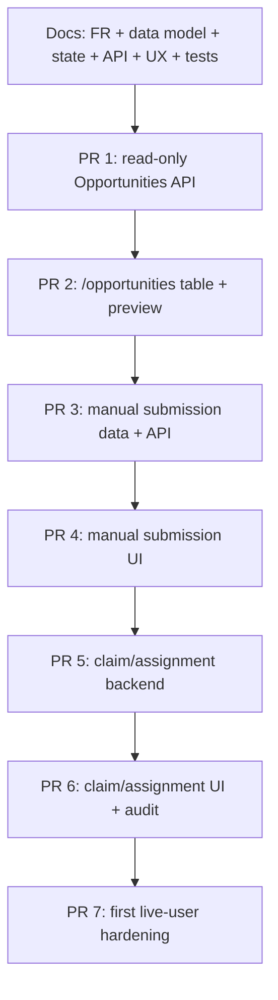

# V2 Implementation Index

Status: Active execution index  
Date: 2026-05-18  
Scope: What to build next, in what order, and which docs must exist first

This is the operational index for starting v2 safely. It does not replace the
requirements docs; it tells the next developer where to go and what order to use.

## 1. Current Phase

```text
Phase: pre-build control docs
Code status: v2 implementation not started
Main branch: production/current system is clean
Next objective: define V2-Core traceability, then ship read-only Opportunities
```

## 2. Required Next Docs

Complete these in order:

| Order | File | Output required |
|---:|---|---|
| 1 | `02-functional-requirements.md` | FR IDs for V2-Core, V2.5, V3. Must include read-only queue, manual submission, claim, assignment, touches, offers, dispositions. Created; use it as the source for downstream schema/state/API/UX/test docs. |
| 2 | `03-data-model.md` | Exact table/view plan for Opportunity read model, manual submissions, claim/assignment, touches, events. Created; use it as the source for migration planning. |
| 3 | `04-state-machines.md` | Opportunity, claim, assignment, status, offer, approval, disposition, validation transitions by milestone. Created; use it as the source for API and UX workflow gates. |
| 4 | `05-api-contract.md` | `/app/opportunities*` contracts and future offer/disposition contracts. Created; use it as the source for Worker/web client implementation. |
| 5 | `06-ux-spec.md` | `/opportunities` table, preview pane, detail page, manual submission, empty/loading/error states. Created; use it as the source for frontend implementation. |
| 6 | `09-test-strategy.md` | Test matrix that maps FR -> schema/state/API/UX. Created; use it as the acceptance gate for implementation PRs. |

Recommended but can follow immediately after:

| File | Why |
|---|---|
| `07-non-functional-requirements.md` | Performance, retention, observability, reliability for live testing. |
| `08-metrics-and-observability.md` | Queue health, claim age, source health, first-touch timing. |
| `12-security-and-access.md` | Buyer/closer/admin visibility, role/tier map, future approvals. |

## 3. V2-Core Work Packages



### PR 1 — Read-Only Opportunities API

Milestone: `V2-Core`

Goal:

- Return a product read model from existing data only.

Likely route:

```text
GET /app/opportunities
GET /app/opportunities/:id
```

Inputs:

- `leads`
- `filtered_out`
- `normalized_listings`
- `vehicle_candidates`
- `duplicate_groups`
- `valuation_snapshots`
- `source_runs`
- score attribution where useful

Out of scope:

- claim writes
- assignment writes
- manual submissions
- offers
- dispositions

### PR 2 — Opportunities Table + Preview

Milestone: `V2-Core`

Goal:

- Add `/opportunities` page with dense table and right preview pane.

Must show:

- source/run
- vehicle facts
- price
- MMR/spread
- grade/final score/reason context
- badges: first seen, seen again, price changed, VIN appeared, estimated miles,
  estimated style, estimated MMR, near miss, possible duplicate
- finder/assignee placeholders if not yet implemented

Out of scope:

- claim button
- manual submit form
- offer actions

### PR 3 — Manual Submission Backend

Milestone: `V2-Core`

Goal:

- Store buyer/finder-submitted listing links and relevant facts.

Must support:

- URL
- submitted_by
- optional assigned closer
- year/make/model/style if known
- price/mileage if known
- free-text context
- source/region if known
- honest missing fields

Open design choice:

- whether manual submissions get their own table first or enter normalized
  listings immediately. Decide in `03-data-model.md`.

### PR 4 — Manual Submission UI

Milestone: `V2-Core`

Goal:

- Let a buyer/finder submit a link and optional closer assignment from the web
  app.

Must preserve:

- current group-chat behavior, but structured
- optional closer routing
- same Opportunities queue visibility

### PR 5 — Claim / Assignment Backend

Milestone: `V2-Core`

Goal:

- Server-side claim/assignment with 24-hour window and concurrency safety.

Must define before code:

- claimable states
- who can claim
- who can assign/reassign
- what happens when already claimed
- expiration behavior
- audit writes

### PR 6 — Claim / Assignment UI

Milestone: `V2-Core`

Goal:

- Show owner, claim timestamp, expiration, and prior evaluator warning.

Must support:

- first required action = claim
- all users see queue
- already evaluated/claimed warning with timestamp

### PR 7 — Live Testing Hardening

Milestone: `V2-Core`

Goal:

- Prepare Rami + one or two users for live testing.

Must include:

- smoke checklist
- basic admin correction path
- monitoring / runbook update
- known limitations clearly visible

## 4. V2.5 Work Packages

| Package | Purpose |
|---|---|
| Lead/opportunity touches | Structured calls, texts, notes, seller context, outcomes. |
| On-duty readiness | Staff availability model before approvals need routing. |
| AppSheet cutover telemetry | Measure when new workflow can replace old screens. |
| Shared event/audit substrate | Foundation for v3 approval/disposition governance. |

## 5. V3 Work Packages

| Package | Purpose |
|---|---|
| `lead_offers` | Customer-facing offers and counters. |
| Approval gate | Junior/Closer/Senior/VIP tier enforcement. |
| `lead_dispositions` | Final win/loss/no-deal outcome. |
| Validator queue | Post-hoc training and calibration. |
| Closer dashboard | Hunting, working, awaiting, disposing modes. |

## 6. V3+ Work Packages

| Package | Purpose |
|---|---|
| Full approval audit analytics | Cross-workflow audit beyond the offer row. |
| Approval SLA timers | Escalation when approvals stall. |
| Delegated approval | Temporary authority with limits and audit. |
| Fraud/collusion analytics | Approver/submitter pair and approval-to-outcome drift. |
| Coaching/calibration automation | Use validated dispositions to train humans and buybox. |

## 7. Current Open Decisions To Resolve First

Pull from `13-open-questions-log.md`, but these are the ones most likely to block
the first implementation:

| Decision | Default |
|---|---|
| Opportunity as view/read model vs persisted table | Start as read model if possible; persist only workflow submissions/events. |
| Near-miss inclusion threshold | Include scored/filtered listings with filter reasons; tune after seeing volume. |
| Claim expiration mechanics | 24 hours; expiration makes item reclaimable, not deleted. |
| Manual submission storage path | Separate table first if normalization cannot be guaranteed. |
| Finder/closer/admin permissions | First live users all see full queue; admin can correct/reassign. |

## 8. Review Checklist For Every V2 PR

Before review:

- Which FR IDs does this PR implement?
- Which milestone tags are included?
- Which schema/state/API/UX/test docs changed?
- Did the PR touch ingestion, MMR, auth, or service secrets?
- Does it preserve raw/normalized/candidate/lead boundaries?
- Does it show estimates as estimates?
- Does it keep browser -> Next proxy -> Worker boundaries intact?
- Are near-miss/repeat/price/VIN events visible instead of hidden?
- Are tests mapped to the FRs?

If the answer is fuzzy, the PR is not ready.

## 9. Stop Conditions

Stop implementation and update docs/open questions if:

- an Opportunity needs data not represented by the model
- claim/assignment behavior is ambiguous
- a UI action implies a write not covered by a state machine
- a near-miss/repeat rule would silently hide a row
- an estimate would display without a badge
- a route would expose secrets or call a vendor from the browser
- a v3 feature is about to sneak into a v2 PR

## 10. First Prompt For The Next Developer

Use this exact shape:

```text
Read docs/06-platform/README.md,
docs/06-platform/18-new-developer-handoff.md,
docs/06-platform/19-v2-implementation-index.md,
docs/06-platform/15-current-architecture-map.md,
docs/06-platform/16-final-outcome-architecture-map.md,
docs/06-platform/17-current-file-by-file-review.md,
docs/02-product/v2-opportunities.md, and
docs/06-platform/13-open-questions-log.md.

Produce docs/06-platform/02-functional-requirements.md.
Tag every requirement by milestone.
Every V2-Core requirement must cite source review/business requirement context
and must be written so it can later trace to schema, state machine, API, UX, and
tests. Do not implement code.
```
