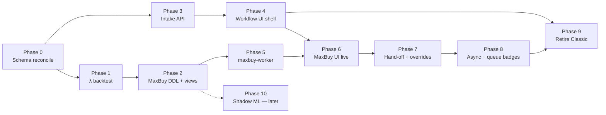

# TAV Implementation Plan — MaxBuy + Workflow / UI Redesign

**Status:** Active execution plan  
**Last updated:** 2026-06-07 (progress: P0–P9 + OPEN-5 shipped on \main\; **P10 Shadow ML** next)  
**Audience:** Cursor agents, solo dev, reviewers  
**Repo prefixes:** `TAV-BB-*` (MaxBuy) · `TAV-WF-*` (workflow/UI) · combined milestones may use `TAV-MVP-*`

> **How to use with Cursor:** Point the agent at this file (`@docs/IMPLEMENTATION-PLAN.md`) for the full picture. It embeds the decisions, constraints, file map, and phase dependencies needed to implement without re-reading every spec. Deep references live at the bottom — read those only when this doc says to.

---

## 0. Pre-push CI gate (required — do not skip)

Every push to `main` triggers GitHub Actions. A failed run emails **web-ci** and/or **CI** — fix before starting the next feature, or you will keep breaking `main` and redeploying hotfixes.

### When each workflow runs

| Workflow | Triggers on push when you change… | Job |
|----------|----------------------------------|-----|
| **web-ci** | `web/**`, `.github/workflows/web-ci.yml` | `lint` → `build` → `typecheck` → `test` (pnpm, Node 20, `web/`) |
| **CI** | `main` / PR (root `package.json`) | `lint` → `typecheck` → `vitest` → integration (npm, repo root) |

Touching **only** `src/`, `workers/`, or `supabase/` does **not** run web-ci — but any **web** or **shared UI** work must pass web-ci before push.

### Run locally before `git push` (match CI order)

**Web (mandatory if `web/` changed):**

```bash
cd web
pnpm install --frozen-lockfile   # or npm ci if you use npm locally
pnpm lint                        # must be 0 errors (eslint; react-hooks rules are strict)
pnpm build                       # needs placeholder env like CI — see web-ci.yml
pnpm typecheck                   # run after build (typedRoutes needs .next/types)
pnpm test
```

**Worker / API (mandatory if root `src/`, `test/`, `workers/` changed):**

```bash
npm ci
npm run lint
npm run typecheck
npm test
```

### Common web-ci failures (Phase 7+)

| Failure | Fix |
|---------|-----|
| `react-hooks/set-state-in-effect` | Do not reset dialog form state in `useEffect` — reset in `onOpenChange` when `open` becomes true, or key the form by `open`. |
| `typedRoutes` / missing `RouteImpl` | Run `pnpm build` in `web/` before `pnpm typecheck`. |
| ESLint **errors** (not warnings) | `pnpm lint` must exit 0; warnings in unrelated files are OK today but prefer cleaning them. |

### Agent / dev rule

1. Implement the phase task.  
2. Run the matching local commands above for every path you touched.  
3. Only then commit and push to `main`.  
4. If GitHub emails a failure, treat it as **blocking** — open the [Actions run](https://github.com/ramialbanna/TAVEnterprise/actions), reproduce locally, push a fix before more product work.

Workflow definitions: [`.github/workflows/web-ci.yml`](../.github/workflows/web-ci.yml) · [`.github/workflows/ci.yml`](../.github/workflows/ci.yml)

---

## 1. What we are building

Two interlinked initiatives ship as **one buyer experience**:

| Track | Goal | Primary specs |
|-------|------|---------------|
| **MaxBuy** | VIN → expected sale, costs, recommended max buy, explainable verdict | [`07-buybox/TECHNICAL-SPEC.md`](07-buybox/TECHNICAL-SPEC.md) · [`07-buybox/ARCHITECTURE.md`](07-buybox/ARCHITECTURE.md) |
| **Workflow / UI** | Fast intake, clearer IA, deal detail as decision surface | [`02-product/workflow-and-ui-redesign.md`](02-product/workflow-and-ui-redesign.md) |

**Combined user journey (target):**

```text
Submit listing (parse URL) → Opportunities queue (triage) → Claim deal →
  Run MaxBuy (VIN + ask + miles) → Verdict + max buy →
  Override / pass (structured) OR workflow next step →
  Join keys preserved for external profit analytics
```

---

## 2. Current state (verified 2026-06-01)

### 2.1 Platform (unchanged)

| Area | State |
|------|-------|
| Ingest pipeline | Live — scraper → normalize → score → `leads` |
| Opportunities v2 | Phases 5–7 done — assign, claim, status, notes |
| MMR / intelligence | `tav-intelligence-worker` live; contract `mmr-v1` pinned |
| `/mmr-lab` | Wholesale lookup only — **not** MaxBuy evaluate |
| Ingest buy-box rules | Live — `tav.buy_box_rules` at scrape time (**separate from MaxBuy**) |
| New UI shell | **Done** — Classic retired (Phase 9); single New-mode design system |

### 2.2 MaxBuy — shipped through Phase 7

| Item | State |
|------|-------|
| Historical outcomes | **57,228** rows in prod `tav.purchase_outcomes` |
| `tav.historical_sales` | **0 rows** — do not use for λ backtest |
| Schema reconcile (P0) | **Done** — `0052_purchase_outcomes_prod_reconcile.sql` on `main` |
| λ backtest (P1) | **Done** — **180d** half-life; [`07-buybox/reports/10-decay-rate-report.md`](07-buybox/reports/10-decay-rate-report.md) |
| MaxBuy DDL + views (P2) | **Done** — `0053`–`0056`; benchmark views live in prod (`bm-*-180d`) |
| Scoring module (P2) | **Done** — `src/maxbuy/scoring/` + unit tests |
| MMR contract CI (P2) | **Done** — `test/maxbuy.mmr-contract.test.ts` |
| MaxBuy API / worker (P5) | **Done** — `workers/maxbuy-worker/`, `POST /maxbuy/evaluate`, overrides, passes on `main` |
| MaxBuy UI (P4–P6) | **Done** — `/maxbuy` page, `MaxBuyCard` live on deal detail + standalone; overrides + passes UI on `main` |
| Decisions DEC-1–4 | Closed — $800 target, data strength not %, stub gates, etc. |

### 2.3 Execution progress (unified phases)

| Phase | Focus | Status | Branch / commit area |
|-------|--------|--------|----------------------|
| **0** | Schema reconcile | ✅ Shipped | `0052` · `main` |
| **1** | λ decay backtest | ✅ Shipped | `scripts/maxbuy/decay-backtest/` · report · `main` |
| **2** | MaxBuy DDL + benchmark views + scoring | ✅ Shipped | `0053`–`0056` · `src/maxbuy/` · `main` |
| **3** | Intake parse + `entry_method` | ✅ Shipped on `main` | `main` |
| **4** | Workflow UI shell + MaxBuy card placeholder | ✅ Shipped on `main` | `main` |
| **5** | `maxbuy-worker` evaluate API | ✅ Shipped on `main` | `main` |
| **6** | MaxBuy UI live | ✅ Shipped | `main` |
| **7** | Hand-off, overrides + passes | ✅ Shipped on `main` | `main` |
| **8** | Async evaluate + queue badges | ✅ Shipped on `main` | `main` |
| **9** | UAT / retire Classic | ✅ Shipped on `main` | `main` |
| **10** | Shadow ML | ⬜ Future | — |

### 2.4 Workflow redesign (planning)

| Item | State |
|------|-------|
| Product spec | Draft — [`workflow-and-ui-redesign.md`](02-product/workflow-and-ui-redesign.md) |
| Confirmed decisions | WF-1–10, MB-1–2, MB-4 in §11.1 of workflow doc |
| Parse-from-link | **Built** — `POST /app/opportunities/parse` (Facebook v1); `OPPORTUNITIES_PARSE_ENABLED` default off |
| `entry_method` column | **Live in prod** — `0057`; backfill done; write path at 3.5 |
| Manual submit WF-1 / WF-7 | **Partial** — required fields + duplicate URL block (`0058` attribution events) |
| MaxBuy in nav | **Built** — `web/lib/app-shell/nav-new.ts`; `/maxbuy` route live |

---

## 3. Locked decisions (do not re-litigate)

### 3.1 MaxBuy engineering

| ID | Decision |
|----|----------|
| **MB-ENG-1** | v1 = **Option A** serving — SQL benchmark lookups, not ML |
| **MB-ENG-2** | New **`maxbuy-worker`** Cloudflare Worker; web proxies via `/app/maxbuy/*` |
| **MB-ENG-3** | Run **λ backtest first** on `purchase_outcomes` (90/180/365/540d + no-decay control) |
| **MB-ENG-4** | **Stub hard gates** — enforce PASS only when gate data exists; **MMR missing** always active |
| **MB-ENG-5** | UI: build to TECHNICAL-SPEC + workflow doc; **minimal override/pass** (dropdown + optional note) |
| **MB-ENG-6** | MVP includes **create-from-recommendation** hand-off to Opportunities workflow |
| **MB-ENG-7** | Both UI surfaces in parallel: **`/maxbuy`** + **deal detail MaxBuy card** (shared component) |

### 3.2 Workflow / product (from workflow doc §11.1)

| ID | Decision |
|----|----------|
| **WF-1** | Required submit: URL, region, YMM, price; mileage optional → **“Mileage unknown”** badge |
| **WF-2** | Server-side parse: `POST /app/opportunities/parse` — **Facebook first** |
| **WF-3** | Manual submit **never** creates a `leads` row (Option A) |
| **WF-4** | Keep nav name **Opportunities** (not “Deals”) |
| **WF-5** | Retire Classic after redesign UAT |
| **WF-7** | Duplicate URL: **block submit**, link existing, log re-submit attribution |
| **WF-9** | Force region pick every time |
| **MB-1** | Async MaxBuy after manual submit when VIN present; queue badge when done |
| **MB-2** | Small queue badge when evaluated (e.g. `Buy · $15.5k max`) |
| **MB-4** | **Keep MMR Lab + MaxBuy** — complementary tools (MMR = wholesale book; MaxBuy = TAV history + max buy) |

### 3.3 Architecture constraints (always)

```text
Raw Listing → Normalized Listing → Vehicle Candidate → Lead   (existing — do not break)
                                              ↘
                        MaxBuy Recommendation  (NEW — tav.maxbuy_* only)
```

- MaxBuy **reads** outcomes, valuations, benchmarks — **never writes** to `leads`, `normalized_listings`, or ingest pipeline tables.
- Ingest `buy_box_rules` scoring **stays** for queue triage; MaxBuy is **on-demand** (except MB-1 async after manual submit).
- Immutable snapshots: `maxbuy_recommendations` is append-only; replay pins every versioned input.

---

## 4. Essential technical reference (embedded)

### 4.1 Max-buy formula (v1)

```text
expected_sale_price  ← segment benchmark (decay-weighted sale_pct_mmr × MMR, or segment median)
expected_transport   ← transport benchmark ladder (city → region → manheim → global)
expected_expenses    ← expense benchmark ladder
expected_net_gross   ← expected_sale − price_paid_equiv − transport − expenses (display economics)

recommended_max_buy  ← expected_sale − expected_transport − expected_expenses − target_net_gross
target_net_gross     ← $800 global policy (DEC-1) from tav.maxbuy_policy

verdict              ← deal_fit only when asking_price present; capped at REVIEW when data_strength=low
```

### 4.2 Two-state display

| `asking_price` | `display_state` | UI rule |
|----------------|-----------------|---------|
| Present | `deal_fit` | Show verdict + `delta_to_ask` + buy/pass actions |
| Absent | `vehicle_fit` | Show `recommended_max_buy` ceiling only; **verdict = null** |

### 4.3 Schema drift — prod `purchase_outcomes` extras (not in repo yet)

Prod columns missing from `supabase/schema.sql` / migrations (apply in **Phase 0** before MaxBuy DDL):

`trim`, `sale_date`, `cycle_seq`, `net_gross`, `recon_cost`, `expense_total`, `mmr_source`, `mmr_method`, `mmr_lookup_date`, `mmr_snapshot_id`

**Data source for benchmarks:** `tav.purchase_outcomes` (57,228 rows), not `historical_sales`.

### 4.4 New tables (MaxBuy — from TECHNICAL-SPEC)

| Table | Purpose |
|-------|---------|
| `tav.maxbuy_policy` | Versioned $800 target (+ future segment overrides) |
| `tav.maxbuy_lookups` | User intent; purge detail after 90d |
| `tav.maxbuy_recommendations` | **Immutable replay snapshot** — keep forever |
| `tav.maxbuy_overrides` | Structured disagreement capture |
| `tav.maxbuy_evaluated_passes` | Pass-on logging for learning loop |
| `tav.maxbuy_models` / `maxbuy_pipeline_runs` / `maxbuy_backtests` | Registry (Phase 10+ ML) |

**Workflow FK (default):** add nullable `normalized_listing_id` on `maxbuy_recommendations` when evaluate started from a deal.

### 4.5 Benchmark views (Phase 2)

| View | Purpose |
|------|---------|
| `v_maxbuy_pricing_benchmarks` | Decay-weighted segment sale_pct_mmr + effective N |
| `v_maxbuy_transport_benchmarks` | Transport fallback ladder |
| `v_maxbuy_expense_benchmarks` | Recon/fees by segment |
| `v_maxbuy_net_benchmarks` | Expected net gross |
| `v_maxbuy_market_index` | Weekly wholesale drift (defer if not wired) |

Each materialized refresh stamps `benchmark_version` (e.g. `bm-2026w22-365d`).

### 4.6 API surface

| Endpoint | Owner | Notes |
|----------|-------|-------|
| `POST /maxbuy/evaluate` | maxbuy-worker | Contract v1.0.0 — see TECHNICAL-SPEC §2 |
| `POST /maxbuy/overrides` | maxbuy-worker | Structured override |
| `POST /maxbuy/passes` | maxbuy-worker | Pass-on logging |
| `GET /maxbuy/recommendations/:id` | maxbuy-worker | Snapshot re-fetch |
| `POST /app/opportunities/parse` | main worker | WF-2 — listing URL → prefilled fields |
| `GET /app/opportunities` | main worker | Extend with optional `maxbuy_summary` (Phase 8) |

MMR dependency: call `tav-intelligence-worker` via existing pattern; pin `intelligence_worker_contract_version = "mmr-v1"`. **Never persist `mmr_payload`** in maxbuy tables.

### 4.7 Override types (dropdown v1)

`passed_despite_buy` · `bought_despite_pass` · `bid_reduced` · `title_condition_concern` · `transport_concern` · `manager_call` · `inventory_need` · `other`

Optional free text in addition — never free-text-only.

---

## 5. Interlinked phase map

Phases are **numbered once** for both tracks. Dependencies show what blocks what.



| Phase | MaxBuy track | Workflow track | Ship together? |
|-------|--------------|----------------|----------------|
| **0** | Unblock migrations | Same schema base | ✅ One PR |
| **1** | λ backtest report | — | Buybox only |
| **2** | `maxbuy_*` DDL + benchmark views + MMR CI | Optional: `entry_method` column | Can split 2a/2b |
| **3** | — | Parse endpoint + submit validation + provenance | Workflow only |
| **4** | MaxBuy card **shell** (disabled) | Nav, detail hero, stepper, provenance block | ✅ Shared UI PR |
| **5** | `POST /maxbuy/evaluate` | — | Buybox only |
| **6** | Wire evaluate API | Enable card on `/maxbuy` + deal detail | ✅ **First user-visible MaxBuy** |
| **7** | Overrides, passes, create-from-recommendation | Workflow action stores `recommendation_id` | ✅ |
| **8** | — | MB-1 async post-submit + MB-2 queue badge | Workflow + API read |
| **9** | Feature flag rollout UAT | Retire Classic (WF-5) | ✅ |
| **10** | Shadow ML pipeline | No buyer UI change | Future |

---

## 6. Phase details (actionable)

### Phase 0 — Schema reconcile ✅

**Branch:** `TAV-MVP-phase-0-schema-reconcile` (merged to `main`)  
**Blocks:** Phase 1, 2, and any `entry_method` work

| # | Task | Files / artifacts |
|---|------|-------------------|
| 0.1 | Diff prod vs repo `purchase_outcomes` columns | Supabase MCP / `execute_sql` |
| 0.2 | Migration adding missing prod columns | `supabase/migrations/0052_purchase_outcomes_prod_reconcile.sql` |
| 0.3 | Update `supabase/schema.sql` to match | `supabase/schema.sql` |
| 0.4 | Smoke: row count = 57,228; spot-check `sale_date`, `trim` | SQL verification query |

**Exit criteria:** Repo migrations apply cleanly to prod-shaped DB; no MaxBuy tables yet.

---

### Phase 1 — Decay λ backtest (#10) ✅

**Branch:** `TAV-BB-phase-1-decay-backtest` (merged to `main`) · **Chosen λ:** 180 days  
**Blocks:** Phase 2 benchmark views

| # | Task | Files / artifacts |
|---|------|-------------------|
| 1.1 | Offline script — pull `purchase_outcomes` working set | `scripts/maxbuy/decay-backtest/` (throwaway; optional commit script) |
| 1.2 | Walk-forward 26 weeks; λ grid 90/180/365/540 + no-decay | Same |
| 1.3 | Metrics: sale-price MAE, gross-hit error, stability P95, thin-segment MAE | Report |
| 1.4 | Commit chosen λ + rationale | `docs/07-buybox/reports/10-decay-rate-report.md` |

**SQL pull (use `purchase_outcomes`, NOT `historical_sales`):**

```sql
SELECT year, lower(make) AS make, lower(model) AS model,
       lower(coalesce(trim, 'base')) AS trim,
       coalesce(region, 'unknown') AS region,
       sale_date, sale_price, price_paid, gross_profit, net_gross,
       mmr_value_at_purchase, mileage
FROM tav.purchase_outcomes
WHERE sale_date IS NOT NULL AND sale_price IS NOT NULL
ORDER BY sale_date;
```

**Exit criteria:** Chosen half-life documented; Phase 2 views reference it in `benchmark_version` naming.

---

### Phase 2 — MaxBuy data foundation ✅

**Branch:** `TAV-BB-phase-2-data-foundation` (merge to `main`)  
**Depends on:** Phase 0, 1

| # | Task | Files / artifacts |
|---|------|-------------------|
| 2.1 | `maxbuy_policy` + seed $800 global row | `supabase/migrations/0053_maxbuy_policy.sql` |
| 2.2 | Core tables: lookups, recommendations, overrides, passes | `0054_maxbuy_core_tables.sql` |
| 2.3 | Registry tables (empty until ML) | `0055_maxbuy_registry.sql` |
| 2.4 | Materialized benchmark views with chosen λ | `0056_maxbuy_benchmark_views.sql` |
| 2.5 | Add `normalized_listing_id`, optional `lead_id` FK on recommendations | In 0054 |
| 2.6 | MMR contract CI compat test | `test/maxbuy.mmr-contract.test.ts` + fixture |
| 2.7 | Pure scoring module + unit tests | `src/maxbuy/scoring/` or `workers/maxbuy-worker/src/scoring/` |

**Exit criteria:** Views return segment rows; policy queryable; MMR contract test green; scoring unit tests pass.

---

### Phase 3 — Intake & provenance (Workflow A)

**Branch:** `TAV-WF-phase-3-intake`  
**Depends on:** Phase 0 (for `entry_method` if same migration batch)

| # | Task | Files / artifacts | Status |
|---|------|-------------------|--------|
| 3.1 | Add `entry_method` to `normalized_listings` (or submissions) | Migration `0057_entry_method.sql` | ✅ Prod |
| 3.2 | `POST /app/opportunities/parse` — Facebook v1 | `src/intake/`, `src/app/routes.ts`, tests | ✅ Flag off |
| 3.3 | Tighten `POST /app/opportunities/manual` — required fields WF-1 | `manualSubmissionSchema.ts`, form validation | ✅ |
| 3.4 | Duplicate URL block + attribution log WF-7 | `leadAttribution.ts`, `0058_lead_attribution_events.sql` | ✅ Prod |
| 3.5 | Stamp `entry_method = manual` on submit; scraper stamps `scraper` on ingest | `handleIngest.ts`, manual handler | ✅ |
| 3.6 | Submit page: URL-first, parse CTA, progressive disclosure | `web/app/(app)/opportunities/submit/` | ✅ |
| 3.7 | “Mileage unknown” badge when absent WF-8 | Submit UI + opportunities display | ✅ |

**Exit criteria:** Parse works for Facebook URLs; blocked duplicate submits; required fields enforced; provenance visible in API.  
**Met:** 3.1–3.7 on branch; enable `OPPORTUNITIES_PARSE_ENABLED=true` in env for parse CTA in prod.

---

### Phase 4 — Workflow UI shell + MaxBuy card placeholder (Workflow B+C)

**Branch:** `TAV-WF-phase-4-ui-shell`  
**Depends on:** Phase 3 optional (provenance block needs `entry_method`)  
**Parallel with:** Phase 2 OK (UI shell does not need API)

| # | Task | Files / artifacts | Status |
|---|------|-------------------|--------|
| 4.1 | Add **Max buy** to buyer nav (keep MMR Lab in ops per MB-4) | `web/lib/app-shell/nav-new.ts` | ✅ |
| 4.2 | Route stub `/maxbuy` with disabled/coming-soon card | `web/app/(app)/maxbuy/` | ✅ |
| 4.3 | Shared `MaxBuyCard` component — **shell only**, props-driven | `web/components/maxbuy/maxbuy-card.tsx` | ✅ |
| 4.4 | Deal detail: listing hero + provenance block | `opportunity-detail-hero.tsx`, `opportunity-provenance-block.tsx` | ✅ |
| 4.5 | Workflow stepper: Found → Working → Contacted → Outcome | `opportunity-workflow-stepper.tsx` | ✅ |
| 4.6 | Embed MaxBuyCard placeholder below hero (disabled state) | `opportunity-detail-client-new.tsx` | ✅ |
| 4.7 | Opportunities queue tabs polish (Needs action / Mine / etc.) | Existing `opportunities-queue-tabs.tsx` + `?view=` | ✅ (shipped Phase 1–2) |
| 4.8 | Home action tiles (not a recycled table) | `dashboard-home-new.tsx` + Max buy tile | ✅ |

**Exit criteria:** New shell navigable; deal detail layout matches workflow doc §5.4 wireframe; MaxBuyCard renders mock/disabled state. **Met on branch** (New mode detail + `/maxbuy`).

---

### Phase 5 — maxbuy-worker API (MaxBuy Phase 2)

**Branch:** `TAV-BB-phase-2-evaluate-api`  
**Depends on:** Phase 2

| # | Task | Files / artifacts |
|---|------|-------------------|
| 5.1 | Scaffold `workers/maxbuy-worker/` + wrangler.toml | New worker |
| 5.2 | `POST /maxbuy/evaluate` — full handler flow (see §4.1) | `handlers/evaluate.ts` |
| 5.3 | Gate runner — stub framework + MMR missing active | `gates/` |
| 5.4 | Intelligence client — mmr-v1 | `clients/intelligence.ts` |
| 5.5 | Persistence — insert lookup + immutable recommendation | `persistence/` |
| 5.6 | Main worker proxy `POST /app/maxbuy/evaluate` | `src/app/routes.ts` |
| 5.7 | `POST /maxbuy/overrides`, `POST /maxbuy/passes` | Handlers |
| 5.8 | Replay test — pinned inputs reproduce verdict | `test/maxbuy.replay.test.ts` |
| 5.9 | Admin feature flag `MAXBUY_EVALUATE_ENABLED` | Env + `/app/system-status` |

**Exit criteria:** Evaluate returns TECHNICAL-SPEC §2 JSON; snapshots immutable; P99 target < 1.5s incl. MMR.

---

### Phase 6 — MaxBuy UI live (MaxBuy Phase 3 + Workflow F)

**Branch:** `TAV-MVP-phase-6-maxbuy-ui`  
**Depends on:** Phase 4 (shell), Phase 5 (API)

| # | Task | Files / artifacts |
|---|------|-------------------|
| 6.1 | `useMaxbuyEvaluate` hook → `/app/maxbuy/evaluate` | `web/components/maxbuy/use-maxbuy-evaluate.ts` |
| 6.2 | `MaxBuyEvaluateForm` — VIN, mileage, asking price | `maxbuy-evaluate-form.tsx` |
| 6.3 | Wire MaxBuyCard — two-state display, data strength, reason codes | `maxbuy-card.tsx` |
| 6.4 | **`/maxbuy` page** — mobile-first lane lookup | `web/app/(app)/maxbuy/page.tsx` |
| 6.5 | **Deal detail** — “Run max buy”; prefill ask/miles; pass `normalized_listing_id` | opportunities detail |
| 6.6 | VIN gate — no VIN → “Add VIN to run MaxBuy” (no fake evaluate) | Detail card |
| 6.7 | Show MMR wholesale inside MaxBuy card; link to `/mmr-lab` for deep wholesale-only | MB-4 |
| 6.8 | Feature flag gates live evaluate | Admin + env |

**Exit criteria:** Same MaxBuyCard on both surfaces; evaluate persists snapshot; `deal_fit` / `vehicle_fit` correct; flag-controlled rollout.

---

### Phase 7 — Hand-off, overrides & learning loop

**Branch:** `TAV-MVP-phase-7-handoff`  
**Depends on:** Phase 6

| # | Task | Files / artifacts |
|---|------|-------------------|
| 7.1 | Override dialog — dropdown + optional note | `maxbuy-override-dialog.tsx` |
| 7.2 | Pass dialog — `pass_reason` + optional note | `maxbuy-pass-dialog.tsx` |
| 7.3 | Actions: **Pass anyway** · **Bid lower** · **Create work item from snapshot** | MaxBuyCard footer |
| 7.4 | `POST /maxbuy/overrides` + `POST /maxbuy/passes` wired from UI | Hook |
| 7.5 | Create-from-recommendation: store `maxbuy_recommendation_id` on workflow note/activity | Opportunities mutation + API |
| 7.6 | From deal detail: attach to existing listing (no new row) | Handler logic |
| 7.7 | From standalone `/maxbuy`: optional pre-filled manual submit — **OPEN: product confirm** | Defer or minimal |

**Exit criteria:** Override/pass rows written; recommendation_id preserved on workflow actions; join chain §5.6 of workflow doc satisfied.

---

### Phase 8 — Async evaluate & queue badges (MB-1, MB-2)

**Branch:** `TAV-MVP-phase-8-async-badges`  
**Depends on:** Phase 6

| # | Task | Files / artifacts |
|---|------|-------------------|
| 8.1 | After manual submit success: async evaluate if VIN present | Manual submit handler + queue job |
| 8.2 | No VIN → queue state “MaxBuy pending — add VIN” | Opportunities read model |
| 8.3 | Extend `GET /app/opportunities` with latest `maxbuy_summary` per listing | `src/persistence/opportunities.ts` |
| 8.4 | Queue compact badge: `Buy · $15.5k max` — not a second score column | opportunities table |
| 8.5 | Tab badge counts WF-10 (assign / team submit / expiring claim) | Nav + API |

**Exit criteria:** MB-1 async path non-blocking; MB-2 badge visible when evaluated; no evaluate on ingest rows without VIN.

---

### Phase 9 — UAT, rollout, retire Classic ✅

**Branch:** `TAV-WF-phase-9-uat`  
**Depends on:** Phase 7–8 stable

| # | Task | Files / artifacts |
|---|------|-------------------|
| 9.1 | UAT script — submit → claim → evaluate → override → workflow | `docs/05-process/maxbuy-uat.md` (optional) |
| 9.2 | Enable `MAXBUY_EVALUATE_ENABLED` for closers → all buyers | Admin |
| 9.3 | Retire Classic/New toggle (WF-5) | Remove dual UI paths |
| 9.4 | Update `docs/07-buybox/STATUS.md` punch list | Status doc |
| 9.5 | Success metrics check — evaluate median < 3s; parse > 70% | §13 workflow doc |

**Exit criteria met:** Single design system; MaxBuy in daily buyer nav; Classic removed.

---

### Phase 10 — Shadow ML (future — out of MVP)

Per DEC-2: weekly Python pipeline, champion/challenger, **no buyer UI change** until promotion gate passes. See [`07-buybox/ARCHITECTURE.md`](07-buybox/ARCHITECTURE.md) §3 Option B1.

**Do not start until Phase 9 complete.**

---

## 7. File map (where code goes)

```text
supabase/migrations/0052+     # Phase 0–2 schema
scripts/maxbuy/decay-backtest/ # Phase 1 (optional commit)
workers/maxbuy-worker/         # Phase 5
src/maxbuy/ OR worker/src/     # Scoring pure functions (Phase 2/5)
src/app/routes.ts              # /app/maxbuy/* proxy (Phase 5)
web/components/maxbuy/         # Shared UI (Phase 4–7)
web/app/(app)/maxbuy/          # Standalone page (Phase 4 stub → 6 live)
web/app/(app)/opportunities/   # Detail embed (Phase 4–8)
web/lib/app-shell/nav-new.ts   # Max buy nav item (Phase 4)
test/maxbuy.*.test.ts          # Contract, replay, gates
docs/07-buybox/reports/        # λ backtest report (Phase 1)
```

**Reuse — do not rebuild:**

| Need | Use |
|------|-----|
| MMR lookup | `tav-intelligence-worker` + `src/types/intelligence.ts` (`MmrResponseEnvelopeSchema`) |
| Auth pattern | Existing `/app/*` Google domain auth |
| Opportunities data | `src/persistence/opportunities.ts` |
| New UI patterns | `web/app/(app)/opportunities/_components/*-new.tsx` |
| MMR Lab UX reference | `web/app/(app)/mmr-lab/_components/mmr-lab-client.tsx` |

---

## 8. Testing checklist (by phase)

| Phase | Tests |
|-------|-------|
| 1 | Backtest reproducible; excluded row counts documented |
| 2 | Migration applies; view spot queries; MMR contract fixture |
| 3 | Parse unit + integration; manual validation; duplicate URL block |
| 5 | Evaluate handler; gate MMR missing → PASS; replay reproduces verdict |
| 6 | MaxBuyCard two-state; E2E `/maxbuy` + deal detail evaluate |
| 7 | Override/pass POST; recommendation_id on workflow action |
| 8 | Async submit does not block; badge appears after evaluate |

---

## 9. Rollout & feature flags

| Flag | Phase | Default |
|------|-------|---------|
| `MAXBUY_EVALUATE_ENABLED` | 5+ | `false` — admin enables |
| `OPPORTUNITIES_PARSE_ENABLED` | 3 | `false` until parse stable |
| Classic UI | 9 | Remove after UAT |

**Rollout order:** migrations → views → worker (dark) → UI (flag off) → admin UAT → closers → all buyers → async MB-1.

---

## 10. Open items (resolve during build)

| ID | Question | Default if silent |
|----|----------|-------------------|
| **OPEN-1** | Standalone MaxBuy → create new manual opportunity on hand-off? | Attach metadata only; no auto-create |
| **OPEN-2** | `lead_attribution_events` table vs logging re-submits elsewhere | ✅ **`0058`** — `duplicate_url_resubmit` events |
| **OPEN-3** | Prod schema reconcile — any columns beyond §4.3 list? | Owner confirms before Phase 0 apply |
| **OPEN-4** | MB-3: FK `normalized_listing_id` on recommendations | **Yes** — nullable FK |
| **OPEN-5** | **YMM + mileage evaluate (no VIN)** — MaxBuy must become the main evaluator for manual/new queue entries where VIN is often missing | ✅ **Shipped** — migration 0059, YMM-first evaluate path, dual-path form; caps verdict at REVIEW |

### OPEN-5 — YMM-first MaxBuy (product note, 2026-06-04)

**Problem:** Most new Opportunities submissions (parse URL, manual submit) will **not** have a VIN at intake. MaxBuy is intended to be the **primary** buyer evaluator, but v1 `POST /maxbuy/evaluate` and the UI require a valid 17-char VIN. P8 “async after submit” only helps when a VIN exists; otherwise buyers still see “add VIN” with no economics.

**Direction (when prioritized — no MaxBuy code changes until explicitly scheduled):**

- Accept **year, make, model, mileage** (and region, trim when known) as a first-class evaluate path — not only VIN decode + listing fallback.
- Reuse existing **YMM MMR** path (`lookupMmrByYmm`) and **segment benchmarks** (already YMM-based); cap `data_strength` / verdict per charter when VIN absent.
- Define snapshot identity, pass/override logging, and queue badges for YMM-only runs (OPEN-5 blocks relying on VIN as the only join key).
- UI: evaluate from submit form and queue without forcing VIN first.

**Until OPEN-5 ships:** keep VIN gate in UI/API; document “MaxBuy pending — add VIN” in P8 is a stopgap, not the long-term model.

---

## 11. PR sequence (suggested)

| PR | Phase | Title |
|----|-------|-------|
| 1 | 0 | `TAV-MVP: reconcile purchase_outcomes prod schema` |
| 2 | 1 | `TAV-BB: decay λ backtest + report` |
| 3 | 2 | `TAV-BB: maxbuy DDL, benchmark views, scoring module` |
| 4 | 3 | `TAV-WF: intake parse + required fields + entry_method` |
| 5 | 4 | `TAV-WF: UI shell, nav, MaxBuyCard placeholder, detail hero` |
| 6 | 5 | `TAV-BB: maxbuy-worker evaluate API` |
| 7 | 6 | `TAV-MVP: MaxBuy UI live — /maxbuy + deal detail` |
| 8 | 7 | `TAV-MVP: overrides, passes, create-from-recommendation` |
| 9 | 8 | `TAV-MVP: async post-submit evaluate + queue badges` |
| 10 | 9 | `TAV-WF: retire Classic, UAT fixes, status update` |

PRs 4–5 can run **parallel** to PR 2–3 after PR 1 merges. PR 6 requires PR 3. PR 7 requires PR 5 + 6.

---

## 12. What NOT to do

- Do **not** merge ingest `buy_box_rules` with MaxBuy scoring.
- Do **not** auto-run MaxBuy on every scraper ingest row (MB-1 is manual-submit async only when VIN exists).
- Do **not** show % confidence in UI — `data_strength` label only.
- Do **not** use `historical_sales` for benchmarks (empty).
- Do **not** persist `mmr_payload` in maxbuy tables.
- Do **not** replace `/mmr-lab` entirely (MB-4) — MaxBuy embeds wholesale; MMR Lab stays for deep lookup.
- Do **not** start Phase 10 ML until Phase 9 UAT passes.

---

## 13. Deep reference (read when implementing that area)

| Topic | Doc |
|-------|-----|
| MaxBuy DDL + API contract | [`07-buybox/TECHNICAL-SPEC.md`](07-buybox/TECHNICAL-SPEC.md) |
| MaxBuy architecture + serving options | [`07-buybox/ARCHITECTURE.md`](07-buybox/ARCHITECTURE.md) |
| MMR worker contract | [`07-buybox/WORKER-CONTRACT.md`](07-buybox/WORKER-CONTRACT.md) |
| Data coverage + segment stats | [`07-buybox/DATA-SUMMARY.md`](07-buybox/DATA-SUMMARY.md) |
| Punch list + exit criteria | [`07-buybox/STATUS.md`](07-buybox/STATUS.md) |
| Workflow + UI targets | [`02-product/workflow-and-ui-redesign.md`](02-product/workflow-and-ui-redesign.md) |
| App API patterns | [`03-api/app-api.md`](03-api/app-api.md) |
| Opportunities product spec | [`02-product/v2-opportunities.md`](02-product/v2-opportunities.md) |

---

## 14. Document history

| Date | Change |
|------|--------|
| 2026-06-01 | Initial unified plan — MaxBuy + workflow redesign, interlinked phases P0–P10 |
| 2026-06-01 | Mark P0–P2 complete; refresh §2 current state and progress table |
| 2026-06-01 | Mark P3 steps 3.1–3.4 complete on `TAV-WF-phase-3-intake`; migrations `0057`–`0058` applied prod |
| 2026-06-04 | Add §0 pre-push CI gate; P7 shipped; web-ci fix for dialog `setState-in-effect` lint |
| 2026-06-04 | OPEN-5: YMM + mileage MaxBuy path required for VIN-less manual entries (note only; v1 unchanged) |
| 2026-06-04 | Refresh §2.2/§2.3/§2.4: mark P5–P7 shipped; remove stale “Not built” claims; split P7–9 row; sync STATUS.md |
| 2026-06-07 | P9 shipped — Classic UI retired (WF-5), MAXBUY_EVALUATE_ENABLED=true in prod; all phases P0–P9 complete; OPEN-5 next |
